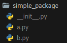

<br />

## Datatypes & Variables:

---

here we define a variable (x) and assign it the value 42

```py
x = 42

# "=" non-mathematical equals sign

print('value of x:', x)
# value of x: 42
```

here we output the value x using the print function
now both variables point to the same object (object 42)

```py
xstring = 'stringx'

ystring = 'stringy'

print('id of stringx: ',id(xstring))
    # id of stringx:  140395292848112

print('id of stringy: ',id(ystring))
    # id of stringy:  140395290122992

ystring = xstring

print('id of string x after it has been set to the value of x: ',id(ystring))
    # id of stringx after it has been set to the value of x:  140395292848112
```

<br />

as you can see the id of the ystring is the same after we assigned it to the same object
to add a certain value of a function we use:

```py
x = x + 36
```

<br />
an alternative is also x += 36 the result is the same there are also other operators
like: "-" "*" "/" "**" "//"integer division and "%" (modulo) more in operatoren.py

```py
print(x)
    # 78
```

<br />

### Static & Dynamic Type declarations

in programming languages like c, c++, and java... the variable must be assigned a type before it can be used
so in c for example:

```c
int i, j;
float x;

x = i /3.0 +5.8;
```

<br />
later the values for i, j and x can change <br />
but not the type so x = float and i/j = int <br />
this is called "static type declaration
<br />
<br />

in python, it is a bit different
because in python the variable has no specific type you don't have to declare it

so for example you need a variable i with the value 369:

```py
i = 369
```

thereby an object with the type integer is created automatically
however this type can be changed during the program run

```py
i = 'Hello World!'
i = [3, 6, 9]
```

however, python assigns a special type/class to the object in each case
python automatically detects the data type
even while the program is running

this is called dynamic type declaration

with the function type, you can display the type:

```py
i = 369
type(i)
# <class 'int'>

i = 'Hello World!'
type(i)
# <class 'str'>

i = [3, 6, 9]
type(i)
# <class 'list'>
```

<br />
nevertheless, type conflict can occur
<br />
for example, if you try to add a variable of type int with a variable of type str
<br />
in this case, a TypeError is generated:
<br />

```py
x = 'string'
y = 369
z = x + y
# Traceback (most recent call last):
#   File "<stdin>", line 1, in <module>
# TypeError: can only concatenate str (not "int") to str
```

<br />
but you can mix integer and float values <br />
the value of the expression then becomes a float

```py
x = 12
y = 3.5
z = x * y
z
# 42.0

type(x)
# <class 'int'>
type(y)
#<class 'float'>
type(z)
# <class 'float'>
```

<br />

## Variable names

---

variables must start with a letter or "\_".
variables are case-sensitive in Python which means that the case must be respected

```py
Test_42 = 'Test42'
test_42 = 'test42 but lower case'

print(Test_42)
# Test42

print(test_42)
# test42 but lower case

```

## Datatypes

### Integers

unlike in other programming languages, integer numbers are unlimited in Python

means they can be of any size, however, no number may begin with 0

```py
very_long = 124039452093423

very_long *= very_long

print(very_long)
```

<br />

#### Binary

if you want to output/store a binary number you need the 0 or 0b/0B for it
and then the binaries

```py
binarie = 0B101010

print('prints binaie 0B101010:',binarie)
```

<br />

#### Octa

literal for an octa number: 0o/0O
and then the octa number

```py
okta = 0o10

print('prints okta 0o10:',okta)
```

<br />

#### Hex

hexadecimal with: 0x/0X
and then the hexa number

```py
hexa = 0x10

print('prints hexa 0x10',hexa)
```

<br />

#### Convert Hex/Bin/Oct

with the function hex/bin/oct you can convert an integer into a string
which corresponds to the number in the corresponding base
so for example:

```py
x = hex(19)

type(x)

x = bin(65)
```

### Float

numbers like:
2.34, 27.3453453 or 3,215e2

```py
x = 2.34
y = 3.14e2  # = 3.14*10²
```

### Complex

the data type complex
complex numbers extend real numbers in such a way that

the equation x²+1 = 0 becomes solvable
in mathematics these are often represented as
a + b \* _i_ where a and b are the real numbers and _i_ is the imaginary unit

in python one uses for the convention of electrical engineering a "j" as imaginary unit

```py
x = 3 + 4j
y = 2 - 4.5j

x + y   # = (5-0.5j)

x * y   # = (24-5.5j)
```

#### Operators

| Operator | Meaning                                           |
| -------- | ------------------------------------------------- |
| x + y    | sum of x and y                                    |
| x - y    | difference of x and y                             |
| x \* y   | product of x and y                                |
| x / y    | quotient of x and y                               |
| x // y   | integer division                                  |
| x % y    | modulo or rest division                           |
| abs(x)   | amount from x                                     |
| x \*\* y | raise to the power of x, i.e. x to the power of y |

with % the rest of an integer division can be determined safely

```py
8 % 3
# 2

9 % 3
# 0

8.0 % 3
# 2.0
```

<br />

correlations between the integer and modulo ZeroDivisionError

```py
x = 24
y = 7
x == (x // y) * y + (x % y)
# True
```

### Boolean

a boolean can only pass two values True or False i.e. 0 or 1
IMPORTANT! upper/lower case

```py
x = False
not x   # (True)

x = True
not x   # (False)

y = False
x and y # will be false  because only x is true and y is false

x or y # only one of them need to be true


x and not y # if x is true and y is false this will return true
```

### Type Conversion

the conversion of a datatype is called type conversion/cast
type conversions are needed when you want to express strings and numeric values:

```py
string1 = 'abcd'
string2 = 'dcba'
number = 369

print(string1 + ' ' + string2 + '  number: ' + str(number))
```

<br />

here we have specifically converted 'number' to a string using the str function
if we had not converted the integer to a string before, python would have generated a TypeError:

```py
print(string1 + ' ' + string2 + '  number: ' + number)

# Traceback (most recent call last):
#   File "<stdin>", line 1, in <module>
# TypeError: can only concatenate str (not "int") to str
```

<br />
python does not support implicit type conversions as they are possible in php or
perl <br />
but there are exceptions for example when we mix integer and float values in an
expression <br />
there the integer value was implicitly converted to a float value <br />

### Determine Datatypes

to determine which class it is, you can use the built-in type function:

```py
l = [3, 6, 9]
type(l)
# <class 'list'>

x = 4
type(x)
# <class 'int'>

x = 4.5
type(x)
# <class 'float'>

x = 'string'
type(x)
# <class 'str'>
```

<br />

isinstance(object, ct)
an alternative to type is: "isinstance" which returns either true or false
object is the object to check and ct is the class to check for

```py
x = (3, 6, 9)
isinstance(x, tuple)
# True
```

<br />

if you want to find out if it is a variable or an integer you could:

```py
x = 4
isinstance(x, int ) or isinstance(x, float)
# True

x = 4.8
isinstance(x, int ) or isinstance(x, float)
# True
```

<br />

with isinstance, however, this can also be done differently:

```py
x = 4.8
isinstance(x,(int, float))
# True

x = (3, 6, 9)
isinstance(x, (list, tuple))
# True

isinstance(x, (int, float))
# False
```

## Sequential Datatypes

### Indexing

the characters of a string are numbered from left to right starting with 0
from the back (right) you start counting with -1
this can be done with: []

```py
>>> text = "Hello World!"
>>> print(text[0])
H
>>> print(text[6])
W

>>> print(text[-4])
r

>>> print(text[-1])
!
```

This works for all sequential data types, including lists and tuples:

```py
>>> l = [42, 3, [6, 9]]
>>> l[0]
42
>>> l[2]
[6, 9]

>>> l[2][1]
9

>>> l[0] = "new value"
>>> l
['new value', 3, [6, 9]]
```

**tuples cannot be changed**

### len Function

The len function reproduces the number of elements of a sequential data type

```py
>>> string = 'Hello World!'
>>> len(string)
12

>>> list = [1, 2, 3, 4, 5, 6, 7]
>>> len(list)
7
```

### Lists

unlike a string, lists consist of a sequence of arbitrary objects
for example integer-numbers,float-numbers, strings or again lists

```py
>>> x = [3, 6, 9, "der traum ist echt"]
>>> y = [42, 44, [45, 89], 88]
```

as you can see lists are generated with the square bracket[] and separated with commas

lists can contain further sub-lists like in example y
but also other objects for example tuples and dictionaries

### Strings

strings consist of an unchanging sequence of characters

this can be done for example with: '

```py
'im a string'
```

or: "

```py
"also a string"
```

works also """ or '''

```py
'''bli bla blub string "this works btw" '''
```

to create multiline strigns offers: \

```py
>>> s = "string string \
  but i go over several lines \
  this is the first line \n\
  and this the second"
>>> print(s)
```

to create a line feed we use: \n

an alternative would be to use the """ but here newlines are taken over into the string

```py
>>> s = """string string
  but i go over several lines
  this is the third line \
  i also belong to the third"""
>>> print(s)
```

<br />

|            |                                                                                               |
| ---------- | --------------------------------------------------------------------------------------------- |
| //         | substitute representation of a backslash                                                      |
| \'         | quotation mark                                                                                |
| \"         | quotes                                                                                        |
| \b         | backspace                                                                                     |
| \f         | form feed                                                                                     |
| \n         | line break                                                                                    |
| \NNAME     | unicode character name for example: print("\n{GREEK SMALL LETTER PI}") prints the greek "pi". |
| \t         | horizontal tab                                                                                |
| \v         | vertical tab                                                                                  |
| \uXXXX     | 16-bit-unicode-character                                                                      |
| \uXXXXXXXX | 32-bit-unicode-character                                                                      |
| \ooo       | ASCII-character okta                                                                          |
| \xhh       | ASCII-character hexadezimal                                                                   |

<br />

sometimes you don't want python to express these escape characters
this can be done by defining a python string as a "raw" string (r/R)

```py
>>> s = "\one line\aandanother one"
>>> print(s)
one line
andanother one

>>> s = r"\one line\aandanother one"
>>> print(s)
\one line\aandanother one

>>> s = R"\one line\aandanother one"
>>> print(s)
\one line\aandanother one
```

[Almost Everything About Strings](#almost-everything-about-strings)

### subdivision operators

As with indexing, the angular clips were used in slicing
Only here are at the beginning and end of the value

```py
>>> txt = 'Hello World'
>>> txt[1:4]
'ell'
>>> txt[0:5]
'Hello'
```

<br />
you can also leave out the initial or end value

```py
>>> txt[:5]
'Hello'

>>> txt[0:-6]
'Hello'
```

<br />
of course also works the other way around:

```py
>>> txt[6:]
'World'
```

<br />
So it would work with lists:

```py
>>> liste = [1, 2, 3, 42, 369]
>>> liste[1:3]
[2, 3]

>>> liste[2:]
[3, 42, 369]

>>> liste[:4]
[1, 2, 3, 42]
```

<br />

the slicing operator also works with 3 arguments
[Beginning, end, step size]²

```py
>>> k = [1, 2, 3, 4, 5, 6, 7, 8, 9, 10, 11]
>>> k[0:11:3]
[1, 4, 7, 10]


>>> text = 'Python is fun! Hello World!'

>>> text[::3]
'Ph  nHlWl'
```

also works:)

works with negative values
The meaning of the values changes:
[End, beginning, negative step size]
If no initial and final value has been given, the list with reverse order is issued:

```py
>>> x = [3, 6, 9, 42, 35]
>>> x[3:1:-1]
[42, 9]

>>> x[4:1:-2]
[35, 9]

>>> l = [1, 2, 3, 4, 5, 6, 7, 8, 9, 10, 11]
>>> l[::-1]
[11, 10, 9, 8, 7, 6, 5, 4, 3, 2, 1]
```

### Tuple

lists and tuples differ only in the way they are parenthesized
so if we want to use the list example in a tuple notation it looks like this:

```py
>>> x = (3, 6, 9, "der traum ist echt")
>>> y = (42, 44, [45, 89], 88)
```

<br />

The biggest difference is that tuples can no longer be changed!
so no object can be removed added or changed

the bracket can also be omitted:

```py
>>> example = 3, 6, 9, "der traum ist echt"
>>> example
(3, 6, 9, 'der traum ist echt')
```

<br />

multiple assignment
instead of one variable name, list as many variable names on the left side of the assignment as the tuple element has

```py
>>> minimum, maximum, text = 42, 369, "der traum ist echt"
>>> minimum
42
>>> maximum
369
>>> text
'der traum ist echt'
```

## Dictionaries:

dictionaries are entered with curly brackets
a key value couple is separated with a double point (:)
and the different couples are separated with a comma

<br />

```py
food = {"ham":"yes", "egg":"yes", "spam":"no"}
print(food)
    # {'ham': 'yes', 'egg': 'yes', 'spam': 'no'}
    # You can output the full dictionary with print
    # The order can be different

food["ham"]
    # 'yes'
    # In order to get the value of a key (Ham) we use cornery slants as in the example

food["ham"]
    # 'no'

food["spam"] = "yes"
    # Changing an existing key works similarly to lists
    # Only that we use the key here ("spam") to change the value ("no" to "yes")

print(food)
    # {'ham': 'yes', 'egg': 'yes', 'spam': 'yes'}
```

<br />

### Define

Let's define a "dictionary"

```py
en_de = {"red":"rot", "green":"grün", "blue":"blau", "yellow":"gelb"}

en_de["red"]
    # 'rot'

en_de["green"]
    # 'grün'
    # The only problem here is that the translation only works in one direction

de_en = {"rot":"red", "grün":"green", "blau":"blue", "gelb":"yellow"}

de_fr = {"rot":"rouge", "grün":"vert", "blau":"bleu", "gelb":"jaune"}

print("red is in french: " + de_fr[en_de['red']])
    # red is in french: rouge
```

<br />

### Errors

If you try on a non defined key (color)

```py
en_de("brown")
    # Traceback (most recent call last):
    #   File "<stdin>", line 1, in <module>
    # TypeError: 'dict' object is not callable
```

<br />

### Nested Dictionaries

```py
de_en = {"rot":"red", "grün":"green", "blau":"blue", "gelb":"yellow"}

de_fr = {"rot":"rouge", "grün":"vert", "blau":"bleu", "gelb":"jaune"}

dictonaries = {"en" : de_en, "fr" : de_fr}

print(dictonaries["fr"]["blau"])
    # bleu
```

<br />

### Allowed Types

not only strings but also integers, floats, strings and tuples are allowed
but no lists or dictionaries

```py
ports = {"21":"File Transfer Protocol (FTP)", "22":"Secure Shell (SSH)"}

adressen = {"John":[ ("John" "Doe"), 2063, "Overdrive"]}
```

#### Variable Keys

use of variable keys is not possible:

```py
dic = {[1, 2, 3]:"test123"}
    # Traceback (most recent call last):
    #   File "<stdin>", line 1, in <module>
    # TypeError: unhashable type: 'list'
```

#### Tupel Is Possible

```py
dic = {(1, 2, 3):"abc", 1.337:"test1337"}
dic
    # {(1, 2, 3): 'abc', 1.337: 'test1337'}

```

<br />

#### .len

len also works on dictionaries

```py
en_de = {"red":"rot", "green":"grün", "blue":"blau", "yellow":"gelb"}
len(en_de)
    # 4
```

<br />

### Error-Free Access

with the keyword "in" you can check if an index occurs in a dictionary

```py
en_de = {"red":"rot", "green":"grün", "blue":"blau", "yellow":"gelb"}
"red" in en_de
    # True

"brown" in en_de
    # False
```

<br />
this could be used to first check if the input is valid and if not, output a corresponding
error message:

```py
en_de = {"red":"rot", "green":"grün", "blue":"blau", "yellow":"gelb"}

color = input("farbe?")

if color in en_de:
    print("The color " + color +" is a key")
    print("the german value for: " + color + " is " + en_de[color])

else:
    print("The color: " + color + " is not a key yet")
    color_de = input("german for " + color + " ? ")
    en_de[color] = color_de
    print("The color " + color + " is now available")
    print(en_de)
```

#### .get

alternatively you can use .get
however no error message is generated here but the defined default value is output
d.get(key[, default])

```py
en_de = {"red":"rot", "green":"grün", "blue":"blau", "yellow":"gelb"}
en_de.get("brown")
    #

en_de.get("red")
    # 'rot'

en_de.get("brown","default")
    # 'default'
```

<br />

### Create From List

dictionaries which consist only of strings which conform to the conventions for variable names
only letters, numbers and underscores can also be simply defined

```py
en_de = dict(red="rot", green="grün", blue="blau", yellow="gelb")
en_de
    # {'red': 'rot', 'green': 'grün',
    #  'blue': 'blau', 'yellow': 'gelb'}
```

<br />

```py
number  = ["1", "2", "3", "4", "5", "6"]
other   = ["a1", "a2", "a3", "a4", "a5", "a6"]

list(zip(number, other))
    # [('1', 'a1'), ('2', 'a2'),
    #  ('3', 'a3'), ('4', 'a4'),
    #  ('5', 'a5'), ('6', 'a6')]
```

as you can see this method outputs the items in tuples

```py
all = dict(zip(number, other))
all
    # {'1': 'a1', '2': 'a2', '3': 'a3', '4': 'a4', '5': 'a5', '6': 'a6'}
```

### ZIP-Function

zip is applied to strings, lists and tuples
so first a tuple with the first two arguments then a tuple with the second and so on...
this goes on until one of the iterable objects is used up

```py
name = ["Peter", "Sarah", "Maria", "Frank", "Eddie"]
value = ["12", "65", "42", "369", "5632"]

for name, money in zip(name, value):
    print(name + " got " + money)
        # Peter got 12
        # Sarah got 65
        # Maria got 42
        # Frank got 369
        # Eddie got 5632


z1 = [11, 12, 13]
z2 = [21, 22, 23]
z3 = [31, 32, 33]

T = zip(z1, z2, z3)
T
    # <zip object at 0x7feffcf58b00>

list(T)
    # [(11, 21, 31), (12, 22, 32), (13, 23, 33)]
```

<br />

from a zip object you can create such a list only once,
after that it is used up
and you get an empty list

```py
list(T)
    # []


    # also possible:
Z = [[11, 12, 13],
     [21, 22, 23],
     [31, 32, 33]]

list(Z)
    # [[11, 12, 13], [21, 22, 23], [31, 32, 33]]
```

#### \*

causes the unpacking of the list

```py
TZ = zip(*Z)
list(TZ)
    # [(11, 21, 31), (12, 22, 32), (13, 23, 33)]
```

<br />

you can also connect two flat lists or tuples

```py
l1 = [11, 12, 13, 14]
l2 = [21, 22, 23, 24]

list(zip(l1, l2))
    # [(11, 21), (12, 22), (13, 23), (14, 24)]
```

<br />

If the arguments of zip are of different length,
only the smallest length is processed, all other elements are ignored

```py
l1 = [11, 12, 13]
l2 = [21, 22, 23, 24, 25]

list(zip(l1, l2))
    # [(11, 21), (12, 22), (13, 23)]
```

### Methods:

#### .items

```py
D.items()
```

returns set-like object of type dict_item
a view of the key value pairs

```py
de_en = {"rot":"red",
         "grün":"green",
         "blau":"blue",
         "gelb":"yellow"}

x = de_en.items()

type(x)
    # <class 'dict_items'>
x
    # dict_items([('rot', 'red'),
    #             ('grün', 'green'),
    #             ('blau', 'blue'),
    #             ('gelb', 'yellow')])
```

<br />

#### .copy

copy creates a flat copy ([Shallow & Deep Copy](Basics.md#shallow--deep-copy))

```py
de_en = {"rot":"red", "grün":"green", "blau":"blue", "gelb":"yellow"}
d = de_en
d
    # {'rot': 'red', 'grün': 'green',
    #  'blau': 'blue', 'gelb': 'yellow'}

d["gelblich"] = "yellow'"
d
    # {'rot': 'red', 'grün': 'green',
    #  'blau': 'blue', 'gelb': "yellow'",
    #  'gelblich': "yellow'"}

de_en
    # {'rot': 'red', 'grün': 'green',
    #  'blau': 'blue', 'gelb': 'yellow',
    #  'gelblich': "yellow'"}
```

as you can see this does not work
because the base value is always processed as well

```py
de_en = {"rot":"red", "grün":"green", "blau":"blue", "gelb":"yellow"}
d = de_en.copy()
d
    # {'rot': 'red', 'grün': 'green',
    #  'blau': 'blue', 'gelb': 'yellow'}

d["gelblich"] = "yellow'"
d
    # {'rot': 'red', 'grün': 'green',
    #  'blau': 'blue', 'gelb': "yellow'",
    #  'gelblich': "yellow'"}
```

<br />

#### .popitem

```py
D.popitem()
```

return any key value pair and remove it from the dictionary
if the dictionary is empty a KeyError is generated

```py
de_en = {"rot":"red", "grün":"green", "blau":"blue", "gelb":"yellow"}
de_en.popitem()
    #('gelb', 'yellow')
de_en
    # {'rot': 'red', 'grün': 'green', 'blau': 'blue'}

de_en.popitem()
    # ('blau', 'blue')

de_en.popitem()
    # ('grün', 'green')

de_en.popitem()
    # ('rot', 'red')

de_en.popitem()
    # Traceback (most recent call last):
    #   File "<stdin>", line 1, in <module>
    # KeyError: 'popitem(): dictionary is empty'
```

<br />

#### .fromkeys

```py
dict.fromkeys(S[,v])
```

datatype (s/key) and v thus the value
if this is not assigned all get the value None

```py
food = ("French Fries", "Garden Salad", "Grilled Chicken")
d = dict.fromkeys(food)
d
    # {'French Fries': None,
    #  'Garden Salad': None,
    #  'Grilled Chicken': None}

d = dict.fromkeys(food, "enjoy")
d
    # {'French Fries': 'enjoy',
    #  'Garden Salad': 'enjoy',
    #  'Grilled Chicken': 'enjoy'}
```

<br />

#### .keys

```py
D.keys()
```

returns set-like object of type dict_item
a view of the keys

```py
de_en = {"rot":"red",
         "grün":"green",
         "blau":"blue",
         "gelb":"yellow"}

x = de_en.keys()

type(x)
    # <class 'dict_keys'>
x
    # dict_keys(['rot', 'grün', 'blau', 'gelb'])
```

<br />

#### .pop

```py
D.pop(k[,d])
```

removes the specified key(k)
if k is not a key an error is generated unless the value d was used then this is output

```py
de_en = {"rot":"red", "grün":"green", "blau":"blue", "gelb":"yellow"}

x = de_en.pop("rot")
x
    # 'red'
de_en
    # {'grün': 'green', 'blau': 'blue', 'gelb': 'yellow'}


x = de_en.pop("braun")
    # Traceback (most recent call last):
    #   File "<stdin>", line 1, in <module>
    # KeyError: 'braun'

x = de_en.pop("braun", "error test 123")
x
    # 'error test 123'
```

<br />

#### .setdefault

```py
D.setdefault(k[,d])
```

set k to the value d if k is already in D this changes nothing
if d was not set the key of k becomes None

1337

```py
de_en   = {"rot":"red",
           "grün":"green",
           "blau":"blue",
           "gelb":"yellow"}

de_en.setdefault("brown", "braun")
    # 'braun'

de_en.setdefault("grün", "verde")
    # 'green'

de_en.setdefault("orange")
de_en
    # {'rot': 'red',
    #  'grün': 'green',
    #  'blau': 'blue',
    #  'gelb': 'yellow',
    #  'brown': 'braun',
    #  'orange': None}
```

#### .update

adds another dictionary
and if necessary overwrites the old values/keys

```py
de_en   = {"rot":"red",
           "grün":"green",
           "blau":"blue",
           "gelb":"yellow"}

de_en2  = {"yellow":"gelb", "red":"rötlich"}
de_en.update(de_en2)
de_en
    # {'rot': 'red',
    #  'grün': 'green',
    #  'blau': 'blue',
    #  'gelb': 'yellow',
    #  'yellow': 'gelb',
    #  'red': 'rötlich'}
```

<br />

#### .clear

clear deletes all entries:

```py
de_en = {"rot":"red", "grün":"green", "blau":"blue", "gelb":"yellow"}
de_en
    # {'rot': 'red', 'grün': 'green',
    #  'blau': 'blue', 'gelb': 'yellow'}

de_en.clear()
de_en
    # {}
```

## Sets

### Introduction

sets are a collection of unique and unchangeable elements

```py
>>> city = {"Pittsburgh", "Lincoln", "Lubbock", "Corpus Christi"}

>>> print(city)
# output:
{'Lubbock', 'Corpus Christi', 'Pittsburgh', 'Lincoln'}

>>> "Pittsburgh" in city
True

>>> "Berlin" in city
False


>>> cities = set(("Paris", "Lyon", "London", "Berlin", "Paris"))
>>> cities
{'London', 'Paris', 'Berlin', 'Lyon'}
    # you can see that paris occurs only once


>>> x = set("Python1235123")
>>> x
{'h', 't', '1', '3', '2', '5', 'y', 'P', 'o', 'n'}

>>> type(x)
<class 'set'>
```

<br />

sets are implemented in a way that they **do not** allow mutable objects

```py
>>> cities = set((("Python","Perl"), ("Paris", "Berlin", "London")))

>>> cities = set((["Python","Perl"], ["Paris", "Berlin", "London"]))
Traceback (most recent call last):
   File "<stdin>", line 1, in <module>
TypeError: unhashable type: 'list'
```

<br />

even if sets cannot contain mutable objects, a set can be modified:

```py
>>> cities = {"Pittsburgh", "Lincoln", "Lubbock", "Corpus Christi"}
>>> cities.add("Frankfurt")
>>> cities
{'Lubbock', 'Corpus Christi', 'Pittsburgh', 'Lincoln', 'Frankfurt'}
```

<br />

frozensets are like sets only they can not be changed!!

```py
>>> cities = frozenset(["Pittsburgh", "Lincoln", "Lubbock", "Corpus Christi"])
>>> cities.add("Frankfurt")
Traceback (most recent call last):
  File "<stdin>", line 1, in <module>
AttributeError: 'frozenset' object has no attribute 'add'
```

### Methods

<br />

#### Add:

an object is only added as a new element if it is not already contained
if it is already contained calling the function has no effect

```py
>>> city = {"Pittsburgh", "Lincoln", "Lubbock", "Corpus Christi"}
>>> city.add("Frankfurt")
>>> city
{'Lubbock', 'Corpus Christi', 'Pittsburgh', 'Lincoln', 'Frankfurt'}

>>> city.add(["Frankfurt", "Berlin"])
Traceback (most recent call last):
  File "<stdin>", line 1, in <module>
TypeError: unhashable type: 'list'
```

#### Clear:

removes every element of a list

```py
>>> city = {"Pittsburgh", "Lincoln", "Lubbock", "Corpus Christi"}
>>> city.clear()
>>> city
set()
```

#### Copy:

copy creates a flat copy of the set

```py
>>> city = {"Pittsburgh", "Lincoln", "Lubbock", "Corpus Christi"}
>>> cities_backup = city.copy()
>>> city.clear()
>>> cities_backup
{'Lubbock', 'Corpus Christi', 'Pittsburgh', 'Lincoln'}
```

<br />

the next example does not work because: "cities_backup = city"
only creates a pointer (another name for the same object)

```py
>>> city = {"Pittsburgh", "Lincoln", "Lubbock", "Corpus Christi"}
>>> cities_backup = city
>>> city.clear()
>>> cities_backup
set()
```

#### Difference Update:

the method difference_update removes all elements of another set from a set

```py
>>> x = {"a", "b", "c", "d", "e"}
>>> y = {"b", "c"}
>>> x.difference_update(y)
>>> x
{'e', 'd', 'a'}

>>> x = {"a", "b", "c", "d", "e"}
>>> y = {"b", "c"}
>>> x = x - y
>>> x
{'a', 'e', 'd'}
```

#### Difference:

the difference of two or more sets

```py
>>> x = {"a", "b", "c", "d", "e"}
>>> y = {"b", "c"}
>>> z = {"c", "d"}
>>> x.difference(y)
{'d', 'a', 'e'}

>>> x.difference(y).difference(z)
{'a', 'e'}
```

<br />
instead of using difference we could also use "-".

```py
>>> x - y
{'d', 'e', 'a'}

>>> x - y - z
{'e', 'a'}
```

#### Discard:

discard(el)

the element el is removed from a set if it is included
if not nothing happens

```py
>>> x = {"a", "b", "c", "d", "e"}
>>> x.discard("a")
>>> x
{'e', 'b', 'd', 'c'}

>>> x = {"a", "b", "c", "d", "e"}
>>> x.discard("z")
>>> x
{'e', 'b', 'd', 'a', 'c'}
```

#### Intersection:

.intersection(_s_)

returns the intersection of _s_ and the instance set

```py
>>> x = {"a", "b", "c", "d", "e"}
>>> y = {"c", "d", "e", "f", "g"}
>>> x.intersection(y)
{'d', 'e', 'c'}
```

<br />
alternative can also be used &

```py
>>> x = {"a", "b", "c", "d", "e"}
>>> y = {"c", "d", "e", "f", "g"}
>>> x & y
{'d', 'e', 'c'}
```

#### isDisjoint:

.isdisjoint()

returns True if two sets have an empty intersection

```py
>>> x = {"a", "b"}
>>> y = {"c", "d"}
>>> z = {"b", "c"}
>>> x.isdisjoint(y)
True

>>> x.isdisjoint(z)
False
```

#### isSubset:

.issubset()

x.issuperset(y) returns True if x is a superset of y (>=).
a simple greater than sign (>) checks if it is a true superset:
if x > y then x contains at least one element not contained in y

```py
>>> x = {"a", "b", "c", "d", "e"}
>>> y = {"b", "c"}
>>> x.issuperset(y)
True

>>> x > y
True

>>> x >= y
True

>>> x >= x
True

>>> x > x
False

>>> x.issuperset(x)
True
```

#### pop:

.pop()

returns any element the element is removed from the set

```py
>>> x = {"a", "b", "c"}
>>> x.pop()
'a'
>>> x.pop()
'b'
>>> x.pop()
'c'
```

if there are no elements left py returns an error

```py
>>> x.pop()
Traceback (most recent call last):
  File "<stdin>", line 1, in <module>
KeyError: 'pop from an empty set'
```

#### Remove

.remove(_el_)

works like discard only if _el_ is not included an error is generated

```py
>>> x = {"a", "b", "c", "d", "e"}
>>> x.remove("a")
>>> x
{'e', 'b', 'd', 'c'}

>>> x = {"a", "b", "c", "d", "e"}
>>> x.remove("z")
Traceback (most recent call last):
  File "<stdin>", line 1, in <module>
KeyError: 'z'
```

## Input

if the input function is called, the program sequence is stopped until the user makes an entry.
so that the user also knows what he must enter
you can use "input prompt" this is optional
a string is always the output

```py
text = input("your input? ")
    # your input? 12
text
    # '12'

text = input("your input? ")
    # your input? [3, 6, 9]
text
    # '[3, 6, 9]'
type(text)
    # <class 'str'>
```

<br />

### int & float

if you now want to set a specific datatype you have to use int/float

```py
text = int(input("your input? (float) "))
    # your input? (float) 42
text
    # 42
type(text)
    # <class 'int'>


text = float(input("your input? (float) "))
    # your input? (float) 3.69
text
    # 3.69
type(text)
    # <class 'float'>
```

<br />

### Eval

for lists, dictionaries and tuples eval is used

```py
color = eval(input("Colors? "))
    # Colors? ["red","green","yellow"]
color, type(color)
    # (['red', 'green', 'yellow'], <class 'list'>)


frequency = eval(input("frequency? "))
    # frequency? {"a":5, "b":7, "c":3}
frequency, type(frequency)
    # ({'a': 5, 'b': 7, 'c': 3}, <class 'dict'>)
```

## if else

### if

```py
if condition:
    statement
```

<br />

the code(statement) will only be executed if the condition is true

```py
age = int(input("your age? "))
    # your age? 10

if age < 12:
    print("you are under 12")
        # you are under 12
```

### if & else

```py
age =int(input("what is your age? "))

if age < 4:
    print("film is to complicated for you")
else:
    if age < 12:
        print("have fun!")
    else:
        if age < 16:
            print("are you sure?")
        else:
            print("really?!?!?!?!???")
```

### elif

```py
age =int(input("what is your age? "))

if age < 4:
    print("film is to complicated for you")
elif age < 12:
    print("have fun!")
elif age < 16:
    print("are you sure?")
else:
    print("really?!?!?!?!???")
```

### comparison operators

| operator |                          |
| -------- | ------------------------ |
| x == y   | Equals                   |
| x != y   | Not Equals               |
| x < y    | Less than                |
| x <= y   | Less than or equal to    |
| x > y    | Greater than             |
| x >= y   | Greater than or equal to |

### True and False

python considers everything that is not equal to false as true
but what is false?

- numeric null values (0, 0L, 0.0...)
- the boolean value False
- empty strings
- empty lists/tuples
- empty dictionaries
- and the value None

### Compound Condition

you can also use "and", "or", "not"
example:

```py
a = 42
20 < a and a < 100
    # True

b = 369
20 < b and b < 100
    # False
```

## Loops

### While

```py
i = 1
while i <= 4:
    print(i, i**2)
    i += 1
    # 1 1
    # 2 4
    # 3 9
    # 4 16


n = 100
sum = 0
i = 1

while i <= n:
    sum = sum + i
    i = i + 1
print("sum from 1 to " + str(n) + " : " + str(sum))
```

alternatively we can:
sum is a python function that calculates the sum of a list or tuple of numeric values

```py
n = 100
sum(range(1, n+1))
    # 5050
```

or: (gaußsche summenformel)

```py
n = 100
sum = n * (n + 1) / 2
sum
    # 5050.0
```

### Break and Continue

there are two important instructions for loops
"break" to terminate the loop prematurely
"continue" to end a run

```py
list = eval(input("enter list of postiiv values: "))
n = len(list)
i = 0
previous = None
erg = []
while i < n:
    current = list[i]
    i += 1
    if current == previous:
        continue
    if current <= 0:
        print("cancel not positiv value")
        break
    erg.append(current)
    previous = current

print(erg)
```

### Else

```py
import random
n = 20
to_be_guessed = random.randint(1, n)
guess = 0
while guess != to_be_guessed:
    guess = int(input("try again: "))
    if guess > 0:
        if guess > to_be_guessed:
            print("to big")
        elif guess < to_be_guessed:
            print("to small try again")
    else:
        print("maybe next time")
        break
else:
    print("correct answer")

```

break will skip the else part of our loop

### For

```py
languages = ["C", "C++", "Perl", "Python"]
for language in languages:
    print(language)
```

like the while loop, the for loop also has an else statement
which is executed once all elements in the sequence have been processed
and no break has been used

## Read & Write Files

### Read Files

if you want to read a file you first need to open the file:
open(filename, mode)

the open() function takes two arguments
filename with a path if necessary
and the mode "r" for read
if the mode is missing, read ("r") is automatically used as default argument

```py
fobj = open("read_and_write_files/read_example.txt")
for line in fobj:
    print(line.rstrip())
fobj.close()
```

### Write Files

for writing files we use the mode "w" instead of "r

```py
fobj_in = open("read_and_write_files/read_example.txt")
fobj_out = open("read_and_write_files/write_example.txt", "w")


counter = 0
for line in fobj_in:
    counter += 1
    out_line = "{0:>3s} {1:s}\n".format(str(counter), line.rstrip())
    fobj_out.write(out_line)


fobj_in.close()
fobj_out.close()
```

### readlines()

```py
textus_readlines = open("read_and_write_files/read_example.txt").readlines()
print("openlines:\n", textus_readlines)


print(".readlines[3]:\n", textus_readlines[3])
```

### read()

```py
textus_read = open("read_and_write_files/read_example.txt").read()
print(".read[20:34]:\n", textus_read[20:34])
```

### with

if with is used in conjunction with open, the file does not need to be explicitly closed

```py
with open("read_and_write_files/read_example.txt") as fobj_in:
    with open("read_and_write_files/write_example.txt2", "w") as fobj_out:
        counter = 0
        for line in fobj_in:
            counter += 1
            out = "{0:>3s} {1:s}\n".format(str(counter), line.rstrip())
            fobj_out.write(out.rstrip())
```

<br />
you can open mutiple files:

```py
with open("read_and_write_files/read_example.txt") as fobj_in,\
        open("read_and_write_files/write_example2.txt", "w") as fobj_out:
    counter = 0
    for line in fobj_in:
        counter += 1
        out_line = "{0:>3s} {1:s}\n".format(str(counter), line.rstrip())
        fobj_out.write(out_line)
```

## Formated Output

### Print

```py
print( value1, ..., sep=' ', end='\n', file=sys.stdout, flush=False)
```

with print you can output any number of arguments separated by commas

```py
import sys
a = 3.369
print("a =", a)
# a: 3.369
print("a = \n", a)
# a =
#  3.369
```

<br />
with the argument sep you can change the separator that is output between the values:

```py
print("a", "b")
# a b

print("a", "b", sep='')
# ab

print(194, 201, 38, 74, sep='.')
# 194.201.38.74

print("a", "b", sep=":)")
# a:)b
```

<br />
after the output python ends with a newline:

```py
for i in range(3):
    print(i)
# 0
# 1
# 2
```

<br />
you can change the default ("\n") using end=''

```py
for i in range(3):
    print(i, end=" ")
# 0 1 2


for i in range(3):
    print(i, end=" :) ")
# 0 :) 1 :) 2 :)
```

<br />
using file you can output in to a file

```py
fh = open("formatted_output/date.txt", "w")
print("42", file=fh)
fh.close()
```

<br />
its also possible to output into the default error channel:

```py
print("Error: 42", file=sys.stderr)
# Error: 42
```

### C-Style Formating

is seen as an **deprecated** and bad style in python!!!!

```py
print("some value: %4d, another: %3.1f" % (369, 1234.042))
```

Output:

`some value:  369, another: 1234.0`

| Placeholder | Meaning                                                                                                                 |
| ----------- | ----------------------------------------------------------------------------------------------------------------------- |
| d/i         | signed integer (integer, decimal)                                                                                       |
| o           | unsigned integer in octal format                                                                                        |
| u           | absolete otherwise like a signed integer                                                                                |
| x           | unsigned integer (hexadecimal)                                                                                          |
| X           | unsigned integer (hexadecimal), uppercase                                                                               |
| e           | floating point numbers (exponential format)                                                                             |
| E           | like e but uppercase for exponent "e".                                                                                  |
| f           | fixed point displays the number as a fixed point number                                                                 |
| F           | like f but nan is displayed as NAN                                                                                      |
| g           | g corresponds to either e or f this is decided automatically depending on the size of the value and the given precision |
| G           | G is analogous to g but it corresponds to either E or f                                                                 |
| c           | one character                                                                                                           |
| s           | a string any python elements are converted to a string using str()                                                      |
| %           | no argument conversion takes place, a "% sign" is given                                                                 |

| Flag | Meaning                                                                    |
| ---- | -------------------------------------------------------------------------- | ------------------------------------------------------------------ |
| #    | if this character is used with o,x or X the respective value               | is provided with the corresponding following prefix 0, 0o,0x or 0X |
| 0    | the result of the conversion is padded with zeros                          |
| -    | the result of the conversion is left-justified                             |
|      | if no sign is specified, a blank character is placed in front of the value |
| +    | the result will be signed (+ or -) this flag overwrites a "space" flag     |

<br />

### Python-Method (format)

the format syntax looks like this:

```py
template.formate(p0, p1, ..., k0=v0, k1=v1, ...)
```

<br />

```py
"first argument: {0}, second: {1}".format(47, 11)
# 'first argument: 47, second: 11'

"first argument: {1}, second: {0}".format(47, 11)
# 'first argument: 11, second: 47'

"first argument: {1:3d}, second: {0:7.2f}".format(47.42, 11)
# 'first argument:  11, second:   47.42'

"first argument: {}, second: {}".format(47, 11)
# 'first argument: 47, second: 11'
```

<br />

argumnents can be used multiple times:

```py
"first argument: {0:6.2f}, second: {0:6.3f}".format(1.4148)
# 'first argument:   1.41, second:  1.415'
```

<br />

this method also works:

```py
"first argument: {a:5d}, second: {p:8.2f}".format(a=458, p=59.058)
# "first argument: {0:6.2f}, second: {0:6.3f}".format(1.4148)
```

<br />

with the .format method you can output data flush left (<) or flush right (>)

```py
"{0:<20s} {1:6.2f}".format('something and something else:', 3.69)
# 'something and something else:            3.69'

"{0:>20s} {1:6.2f}".format('something and something else:', 3.69)
# '         something and something else:   3.69'

"{0:>20s} {1:6.2f}".format('something & lorem ipsum:', 3.99)
# '         something & lorem ipsum:   3.99'

"{0:<20s} {1:6.2f}".format('something & lorem ipsum:', 3.99)
# 'something & lorem ipsum:            3.99'

"{0:<20} {1:6.2f}".format('something & lorem ipsum:', 3.99)
# 'something & lorem ipsum:            3.99'

"{0:>20} {1:6.2f}".format('something & lorem ipsum:', 3.99)
# '         something & lorem ipsum:   3.99'
```

<br />

| Option | Meaning                                                                                                          |
| ------ | ---------------------------------------------------------------------------------------------------------------- | ------------------------------------------------------------------------------------------------------------------------------- |
| '<'    | field is left-justified within the existing space (strings are left-justified by default)                        |
| '>'    | field is output right-justified within the existing space (numeric values are output right-justified by default) |
| '='    | padding characters are introduced between the sign, if a sign is output, and the actual                          | beginning of the digit of a number so that fields of the type '+00000420' can be output (can only be applied to numeric values) |
| '^'    | a field is output centered within the available space                                                            |

<br />

works only with numerical!!:

| Option | Meaning                                                                                                            |
| ------ | ------------------------------------------------------------------------------------------------------------------ |
| '+'    | sign should always be output, regardless of whether the number is positive or negative.                            |
| '-'    | signshould only be used for negative numbers                                                                       |
| space  | instead of a "+", positive numbers are preceded by a " " space. negative numbers are preceded by a minus sign "-". |

<br />

#### String Literals

formatted string literals are strings preceded by an f
they contain escaping fields that are evaluated for
runtime and formatted according to the format rules

```py
animal = "Dog"
height = 187.4
f"Animal: {animal}, Height: {height:6.2f}"
# 'Animal: Dog, Height: 187.40'

width, precision = 10, 3
x = 369.4238
f"Value: {x:{width}.{precision}}"
# 'Value:   3.69e+02'
```

<br />

#### Dictionaries

```py
capital_country = {
    "united States": "Washington",
    "canada": "ottawa",
    "germany": "Berlin",
    "France": "Paris",
    "United Kingdom": "london",
    "switzerland": "Bern",
    "austria": "vienna",
}

print("countries and their capitals ")
for c in capital_country:
    print("{country}: {capital}".format(country=c, capital=capital_country[c]))
```

```txt
countries and their capitals
united States: Washington
canada: ottawa
germany: Berlin
France: Paris
United Kingdom: london
switzerland: Bern
austria: vienna
```

<br />

you can also use the dictionary directly in the call to the format method
(the ouput is the same)

```py
print("countries and their capitals:")
for c in capital_country:
    format_string = c + ": {" + c +"}"
    print(format_string.format(**capital_country))

```

<br />

#### Local Variables

locals is a function that returns a dictionary with the locally defined names and their current values

```py
a = 42
b = 369
def f(): return 42


locals()
# a lot of text best use the function yourself


print("a={a}, b={b} and f={f}".format(**locals()))
# a=42, b=369 and f=<function f at 0x…>
```

<br />

## Shallow & Deep Copy

```py
>>> x = 3
>>> y = 3
```

x and y are assigned to the same object(3)
the proof that this is really so can be provided with the help of the id-function:

```py
>>> print(id(x), id(y))
10861256 10861256
```

so what happens if we assign a different value to one variable

```py
>>> y = 2
>>> print(id(x) == id(y), x, y)
False 3 2
```

y now points to an integer object of its own

### Shallow Copy

the copy-method can be used to create flat copies of lists

```py
>>> list1 = ["3", "6", "9"]
>>> list2 = list1.copy()
>>> list2[1] = "x"
>>> print(list1)
['3', '6', '9']

>>> print(list2)
['3', 'x', '9']
```

<br />
but as soon as there are sublists in the list to be copied,
<br />
only pointers to these sublists are copied

```py
>>> lst1 = ["a", "b",["cd", "dc"]]
>>> lst2 = lst1.copy()
>>> lst2[0] = "c"
>>> lst2[2][0] = "f"
>>> print(lst1)
['a', 'b', ['f', 'dc']]
```

### Deep Copy

one solution for the problem just described is the module copy
which provides the deepcopy function

```py
>>> from copy import deepcopy
>>> lst1 = ["a", "b",["cd", "dc"]]
>>> lst2 = deepcopy(lst1)


>>> lst2[2][1] = "d"
>>> lst2[0] = "c"
>>> print(lst2)
['c', 'b', ['cd', 'd']]

>>> print(lst1)
['a', 'b', ['cd', 'dc']]
```

### Deep Copy Dictionaries

deepcopy from the module copy works for any python object
from copy import deepcopy

```py
>>> d = {"a": 3, "b": 4}
>>> copy_of_d = deepcopy(d)
>>> d["c"] = 1
>>> d
{'a': 3, 'b': 4, 'c': 1}
>>> copy_of_d
{'a': 3, 'b': 4}
```

also the method copy creates only a flat copy

```py
>>> p = {"John": {"weight": 87.8, "Height": 187.5}}
>>> p = {"John": {"weight": 87.8, "Height": 187.5},"Jane":
  {"weight": 60.6, "height": 168.4}}
>>> p2 = p.copy()
>>> p["Jane"]["weight"] -= 0.4
>>> p2
{'John': {'weight': 87.8, 'Height': 187.5},
 'Jane': {'weight': 60.2, 'height': 168.4}}

>>> p2 = deepcopy(p)
>>> p["Jane"]["weight"] -= 0.2
>>> p2["Jane"]["weight"]
60.0

>>> p["Jane"]["weight"]
59.8
```

### Copy Lists

in this example we create a flat copy of a list

```py
>>> colors1 = ["red", "blue"]
>>> colors2 = colors1
>>> print(colors1)
['red', 'blue']

>>> print(colors2)
['red', 'blue']

>>> print(id(colors1), id(colors2))
140535031048896 140535031048896

>>> colors1 = ["blue", "yellow"]
>>> print(colors1)
['blue', 'yellow']

>>> print(colors2)
['red', 'blue']

>>> colors1 = ["red", "blue"]
>>> colors2 = colors1
>>> colors2[1] = "green"
>>> print(colors1)
['red', 'green']

>>> print(colors2)
['red', 'green']
```

as we have already seen, in the assignment colors1 = colors2
only one reference to the same list is created
so changes within the list object apply to colors1 and colors2
since they point to the same object

## Functions

### Introduction

a function is introduced with def and a freely selectable function name

```py
def functionname(parameters):
    statement
```

<br />

a function returns one or more return statements
if the return is left empty "None" is returned
the same if there is no return statement

```py
def helloWorld(name):
    return "Hello " + name + " !"

print(helloWorld("John"))
# Hello John !

f = "John"
f = helloWorld(f)
print(f)
# Hello John !
```

<br />

### Default Value

you also have the option to assign a default value to a parameter

```py
def helloWorld(name="World"):
    return "Hello " + name + " !"

helloWorld("John")
# 'Hello John !'

helloWorld()
# 'Hello World !'
```

```py
def add(value1=4, value2=2):
    return value1 + value2

add(4)
#6

def add(value1=4, value2=2):
    return value1 + value2

add(4, 4)
#8
```

However, there is a problem,
if we try to use only the second parameter without defining the first one
since the arguments are passed in order.

If only one value is passed it is automatically the first one, so in our case value1

<br />

### Key-Word-Parameters

we can easily solve the problem described in the previous chapter
and at the same time improve the readability of the program

```py
def add(value1=4, value2=2):
    return value1 + value2

add(value1=5)
#7

def add(value1=4, value2=2):
    return value1 + value2

add(value2=12)
#16

def add(value1=4, value2=2):
    return value1 + value2

add(value2=12, value1=33)
#45
```

<br />

### Docstring

docstrings are used for documentation
they are stored in the \_\_doc\_\_ attribute
and do not influence the execution of the function

they are defined directly under the def line of a function

```py
def heyWorld(name="World"):
    """returns Hey to the parameter name"""
    return "Hey " + name + " !"

heyWorld("John")
# 'Hey John !'
```

<br />

docstrings can also be placed at the beginning of a Python file

```py
"""
Voluptate sit proident dolore reprehenderit
enim sunt pariatur irure occaecat anim tempor.
"""


def heyWorld(name="World"):
    """returns Hey to the parameter name"""
    return "Hey " + name + " !"

heyWorld("John")
# 'Hey John !'
```

<br />

### Multiple Return Values

a function can only output one object
but also lists or dictionaries for example

```py
def fib_interv(x):
    if x < 0:
        return -1
    old, new = 0,1
    while True:
        if new < x:
            old, new = new, old+new
        else:
            return (old, new)

for i in (0, 1, 2, 3, 4, 5, 7, 8, 9, 12, 13, 14):
    print(i, fib_interv(i))

# 0 (0, 1)
# 1 (0, 1)
# 2 (1, 2)
# 3 (2, 3)
# 4 (3, 5)
# 5 (3, 5)
# 7 (5, 8)
# 8 (5, 8)
# 9 (8, 13)
# 12 (8, 13)
# 13 (8, 13)
# 14 (13, 21)
```

### Local & Global Variables

variables are, by default, local in a functional
but you can also read global variables within a function

```py
def f():
    print(gh)

gh = "Test123"
f()
# Test123
```

<br />

```py
def f():
    gh = "no Test"
    print(gh)

gh = "Test123"
f()
# no Test
print(gh)
# Test123
```

the last example shows very easily that the variable _gh_ in _f_ is local

```py
def f():
    print(gh)
    gh = "no Test"
    print(gh)

gh = "Test123"
f()
# UnboundLocalError:
print(gh)
```

the variable _gh_ is now ambiguous in _f()_

if you want to write to a variable within a function,
you have to define it explicitly as global

```py
def f():
    global gh
    print(gh)
    gh = "no Test"
    print(gh)

gh = "Test123"
f()
# Test123
# no Test

print(gh)
# no Test
```

<br />

```py
gh
# Traceback (most recent call last):
#   File "<stdin>", line 1, in <module>
# NameError: name 'gh' is not defined

def f():
    global gh
    gh = 369

gh
# Traceback (most recent call last):
#   File "<stdin>", line 1, in <module>
# NameError: name 'gh' is not defined

f()

gh
# 369
```

<br />

### Command-Line Arguments

when starting a Python program you can transfer so-called start arguments

these are separated from each other by a space

they are available inside the Python script in a list (sys.argv)
in addition to the parameters the file name is stored in the list at the first position (sys.argv[0])

```py
import sys

for Argument in sys.argv:
    print(Argument)
```

<br />

### Variadic Functions

variadic functions
allow flexibility in defining functions
where the number of parameters is not fixed at definition

for this, we use "\*"

```py
def print_args(*args):
    for argument in args:
        print(argument)

print_args(369, "Lorem bli bla blu", "more bli bla")
# 369
# Lorem bli bla blu
# more bli bla
```

<br />

```py
def print_args(number, *text):
    print(number, text)

print_args(369, "Lorem bli bla blu", "more bli bla")
# 369 ('Lorem bli bla blu', 'more bli bla')
```

<br />

### \* in function calls

when using a \* in the function call, an argument is unpacked
this can be useful when you want to separate the contents of a list or tuple

```py
def print_args(number1, number2, number3):
    print(number1, number2, number3)

list1 = [3, 6, 9]
print_args(*list1)
# 3 6 9
```

<br />

if you want to pass lists you have to unpack them before you pass them
otherwise, this list is only summarized in a tuple

```py
def print_args(number, *text):
    print(number, text)

list1 = [3, 4, 2, 6, 9]
print_args(369, list1)
# 369 ([3, 4, 2, 6, 9],)
```

```py
def print_args(number, *text):
    print(number, text)

list1 = [3, 4, 2, 6, 9]
print_args(369, *list1)
# 369 (3, 4, 2, 6, 9)
```

<br />

### Any Keyword Parameter

\*\* With we can generate any number of key-word parameters

which are then stored in dictionaries

```py
def gh(**args):
    print(args)

gh()
# {}

gh(de="German", en="English")
# {'de': 'German', 'en': 'English'}
```

as in the last article, we can also use \*\* in the function call

```py
def f(a, b, c, h):
    print(a, b, c, h)

d = {'a':'aaaaaaa', 'b':'bbbbbbb', 'c':'ccccc', 'h':'hhhhh'}
f(**d)
# aaaaaaa bbbbbbb ccccc hhhhh
```

<br />
<br />

## Recursive Functions

### Introduction

recursion is a programming technique in which the function calls itself one or more times.<br/>
in general, you can say that in computer science recursion is a method of problem-solving that relies on solving smaller instances of the problem

<br />

### Python Part

```py
def factorial(n):
    print("factori called with n = " + str(n))
    if n == 1:
        return 1
    else:
        res = n * factorial(n-1)
        print("intermediate result for", n, "factorial(" , n-1, "):"
        , res)
        return res

print(factorial(5))

# factori called with n = 5
# factori called with n = 4
# factori called with n = 3
# factori called with n = 2
# factori called with n = 1
# intermediate result for 2 factorial( 1 ): 2
# intermediate result for 3 factorial( 2 ): 6
# intermediate result for 4 factorial( 3 ): 24
# intermediate result for 5 factorial( 4 ): 120
# 120
```

<br />

### Fibonacci Sequence

> 0, 1, 1, 2, 3, 5, 8, 13, 21, 34, 55, 89, 144.

Leonardo of Pisa, also known as Fibonacci, has created in his book an "artificial rabbit problem".

let's imagine that the initial population is formed by a pair of rabbits, newborn rabbits can mate only at the end of the first month and give birth at the end of the second month. Otherwise, each pair of rabbits will give birth to another pair of rabbits.
(the rabbits are immortal).

[Read More](https://en.wikipedia.org/wiki/Fibonacci_sequence)

<br />

well let's get to the python part

```py
def fibi(n):
    a, b = 0, 1
    for i in range(n):
        a, b = b, a + b
    return a
```

<br />

recursive way

```py
def fib(n):
    if n == 0:
        return 0
    elif n == 1:
        return 1
    else:
        return fib(n-1) + fib(n-2)
```

<br />

if we do it the recursive way the whole program will take much longer because the calculations are done again on each run we can easily solve this by creating a dictionary with the previous calculations

```py
memo = {0:0, 1:1}

def fibm(n):
    if not n in memo:
        memo[n] = fibm(n-1) + fibm(n-2)
    return memo[n]
```

<br />
<br />

## Lists & Tupels

### Stack

a "stack" essentially has 2 functions<br/>
one with which you can put something on the stack<br/>
and one to remove something from the top level of a stack<br/>

| method | meaning                                                                                                                         |
| ------ | ------------------------------------------------------------------------------------------------------------------------------- |
| push   | adds something "on top" to the stack python does not have a function called push but **append** performs the same functionality |
| pop    | return the top object of the stack, removing it in the process                                                                  |
| peek   | allows you to read the "top" value without removing it as with pop                                                              |

<br />

### Stacks In Python

- s.append(x)
  > Add an item to the end of the list.
- s.pop(i)
  > prints the i-th element of an lsite and removes it in the process
- s.pop()
  > If i is not specified, the last object is used

<br />

```py
colors = ["red", "green"]
colors.append("blue")
colors
# ['red', 'green', 'blue']

c = colors.pop()
c
# 'blue'

colors.append(colors.pop())
colors
# ['red', 'green']
```

<br />

### Extend

extend is used to append multiple elements to a list <br/>

> s.extend(t)

t must be an iterable object

```py
fib = [0, 1, 1, 2, 3, 5]
fib.extend([8, 13, 21])
fib
# [0, 1, 1, 2, 3, 5, 8, 13, 21]
```

<br />

if you pass a string it will be split into its individual letters

```py
list1 = []
list1.extend("Test123")
list1
# ['T', 'e', 's', 't', '1', '2', '3']
```

### "+" Operator

```py
bli = [4, 2]
bli = bli + [369]
bli
# [4, 2, 369]
```

this method is also possible but much slower than the append method

<br />

```py
bli = [4, 2]
bli += [369]
bli
# [4, 2, 369]
```

this is better, but still not as fast as the append method

<br />

### Remove a Value

> s.remove(x)

with remove the first occurrence of the value x can be removed

if x is not present a ValueError is generated

<br />

### Count

if you want to count how many times an element is included in a list you can use .count

```py
bli = [4, 2, 369, 4, 2, 2, 2, 42]
bli.count(2)
# 4

bli.count(369)
#1
```

<br />

### Position

with index you get the position of an element within a list

> s.index(x[ , i [, j ] ] )

the index for the x is determined<br/>
if the parameter i is given the search starts at this position and ends at j

```py
bli = [1, 2, 3, 4, 5, 6, 7, 8, 9, 10, 11, 12, 13]
bli.index(1)
# 0

bli.index(10 , 8)
# 9

bli.index(10 , 6, 8)
# Traceback (most recent call last):
#   File "<stdin>", line 1, in <module>
# ValueError: 10 is not in list
```

<br />

### Insert

with append you can append an element to the end of a list but with insert you can insert an element at any place you want

> s.insert(index, object)

```py
bli = [1, 2, 3, 4, 5, 6, 7]
bli.insert(1, 42)
bli
#[1, 42, 2, 3, 4, 5, 6, 7]
```

<br />

### Tupels

as we already know tuples are immutable
means methods like append, insert , pop...
do not exist/work

<br />

#### Empty tuples

empty tuples can be defined with an empty bracket

```py
t = ()
type(t)
# <class 'tuple'>
```

<br />

#### Single Digit Tuples

let's try to define a tuple with only one element

```py
t = (1)
type(t)
# <class 'int'>
```

<br />

does not look good but works

```py
t = (1,)
type(t)
# <class 'tuple'>
```

<br />

#### Packing & Unpacking

another option to define a tuple goes like this:

```py
f = "test", "test123"
type(f)
# <class 'tuple'>
```

<br />

it is called tuple unpacking when you assign the individual values of a tuple to variables

```py
(first, second) = f
print(first, second)
# test test123
```

```py
(first, *everything_else) = 1, 2, 3, 42, 369
print(first)
# 1

print(everything_else)
# [2, 3, 42, 369]
```

<br />

### Unchangeable?

tuples cannot be modified<br/>
but we can edit objects like lists<br/>
because the tuple only contains a pointer to this list<br/>

```py
test = ([],)
test[0].append("bli bla")
test
# (['bli bla'],)
```

<br />

### Sort Lists

#### .sort

.sort will sort the list inplace

```py
test123 = [42, 369, 2, 1, 4, 3,]
test123.sort()
test123
# [1, 2, 3, 4, 42, 369]
```

<br />

#### sorted

sorted returns a sorted list and the original list remains unchanged

```py
test123 = [42, 369, 2, 1, 4, 3,]
test = sorted(test123)
test123
# [42, 369, 2, 1, 4, 3]

test
# [1, 2, 3, 4, 42, 369]
```

<br />

#### reverse

to reverse the sort order set the parameter reverse to True (reverse=True)

this works for .sort and sorted

```py
test123 = [42, 369, 2, 1, 4, 3,]
test = sorted(test123, reverse=True)
test
# [369, 42, 4, 3, 2, 1]

test123.sort(reverse=True)
test123
# [369, 42, 4, 3, 2, 1]
```

<br />

#### Own Sorting Function

if you don't want to sort a list by the standard order relation you can use the parameter key

```py
test = ["Green", "yellow", "blue", "Black", "red"]
sorted(test)
# ['Black', 'Green', 'blue', 'red', 'yellow']
```

```py
test = ["Green", "yellow", "blue", "Black", "red"]
sorted(test, key=str.lower)
# ['Black', 'blue', 'Green', 'red', 'yellow']
```

#### itemgetter

if you want to sort lists containing tuples you can use itemgetter

<br />

sort by the 0-th index:

```py
from operator import itemgetter

test123 = [("John", "Doe", "1337"),
            ("Maria", "Sigibert", "3690"),
            ("Folcmar", "Kester", "4200"),]

sorted(test123, key=itemgetter(0))
# [('Folcmar', 'Kester', '4200'),
#  ('John', 'Doe', '1337'),
#  ('Maria', 'Sigibert', '3690')]
```

<br />

sort after the first index:

```py
sorted(test123, key=itemgetter(1))
# [('John', 'Doe', '1337'),
# ('Folcmar', 'Kester', '4200'),
# ('Maria', 'Sigibert', '3690')]
```

<br />

sort after the second index

```py
sorted(test123, key=itemgetter(2))
# [('John', 'Doe', '1337'),
#  ('Maria', 'Sigibert', '3690'),
#  ('Folcmar', 'Kester', '4200')]

```

<br />
<br />

## Modularization

<br />

### Modules

> ```py
> import math
> ```

is used to provide a library

<br />

```py
math.sin(3.1415)
# 9.265358966049026e-05

sin(3.1415)
# Traceback (most recent call last):
#   File "<stdin>", line 1, in <module>
# NameError: name 'sin' is not defined
```

<br /> <br />

> ```py
> from math import sin, pi
> ```

if you import the function directly you don't need to use the "prefix" math. anymore

```py
sin(3.1415)
# 9.265358966049026e-05
```

however, only the functions that you explicitly import are available, <br/>
i.e. sin and pi in our case.

<br /> <br />

> ```py
> from math import *
> ```

You can also import complete libraries, but this could overwrite already existing functions with the same name

```py
pi = 1337
print(pi)
# 1337

from math import *
print(pi)
# 3.141592653589793
```

<br />

#### Rename

> ```py
> import math as m
> ```

you can also simply import the library and assign a new name for the namespace

<br />

```py
import math as m
m.pi
# 3.141592653589793
```

<br />

#### Modul-Types

<br />

Python:

- .py
- .pyc

<br />

C-Modules:

- .pyd
- .dll
- .so
- …

<br />

c modules linked with the interpreter:

```py
import sys
print(sys.builtin_module_names)
# …
```

<br />

#### Search For Modules

when importing a module, the interpreter searches in the following directories: <br/>

1. in the current directory
2. pythonpath
3. if pythonpath is not set the default directory is searched for

with sys.path you get the directories you are searching in

<br />

#### Contents

with the help of the function "dir" you get all names defined in a module

```py
import math
dir(math)
# …
```

<br />
without an argument "dir" returns all names defined in the namespace

```py
import math
blibla = 369
bli = "asldfhioasp9dasdapsdas"
dir()
# …
```

<br />

#### Own Modules

creating your own python module is extremely easy since every python file is automatically a module

must be present in the search path ([Search For Modules](#search-for-modules))

```py
import example_py_file
```

<br />

#### Documetation

we can use docstring's to document our modules

```py
help(example_py_file)
```

[Docstring](#docstring)

<br />
<br />

### Packages

like creating a module in python, creating a package is just as easy

create a folder with the following struct:



the file \_\_init\_\_.py can be empty

<br />

the modules can now be imported with:

```py
from simple_package import a, b
```

<br />

```py
import simple_package
```

will generate an error message because the modules must be imported individually

to change this we can put:
`from simple_package import a, b`
in \_\_init\_\_.py

<br /> <br />

## Global And Local Variables

variables are generally considered local in python<br/>
unless they are explicitly defined as globaly<br/>

however, this is considered a bad programming style

<br />

### In Functions

```py
def hello():
    s = "John"
    print("hello " + s)

s = "Jane"
hello()
# hello John

print("Hello2 " + s)
# Hello2 Jane
```

```py
def hello():
    print("hello " + s)
    s = "John"
    print("hello " + s)

s = "Jane"
hello()
# Traceback (most recent call last):
#   File "<stdin>", line 1, in <module>
#   File "<stdin>", line 2, in hello
# UnboundLocalError:
```

a variable cannot be local and gloabl at the same time<br/>

therefore python considers the variable s as local<br/>
but since this variable gets a value only after the call, an error is generated

<br />

but you can also write to a global variable, but you have to define it as global with the function global.

```py
def hello():
    global s
    print("Hello1 " + s)
    s = "John"
    print("Hello2 " + s)

s = "Jane"
hello()
# Hello1 Jane
# Hello2 John

print("Hello3 " + s)
# Hello3 John
```

<br />
<br />

## Almost Everything About Strings

<br />

### Splitting

python offers several functions for splitting out a string

- [split](#split)
- [rsplit](#rsplit)
- [splitlines](#splitlines)
- [partition](#partition)
- [rpartition](#partition)

<br />

#### split

```py
string123 = """Everybody is a genius.
But if you judge a fish by its ability to climb a tree,
it will live its whole life believing that it is stupid."""

string123.split()
# ['Everybody', 'is', 'a', 'genius.', 'But', 'if'…
```

<br />

you can also define the separation character

```py
string123 = """Everybody;is;a;genius.
;But;if you judge;a fish by its ability to climb a tree,
 it will live its whole life believing that it is stupid."""

string123.split(';')
# ['Everybody', 'is', 'a', 'genius.',
# 'But', 'if you judge', 'a fish by its ability…
```

<br />

#### maxsplit

with maxsplit you can define how often a string should be split starting from left

you do not want to specify a separating character<br/>
you can put None in the place

```py
string123 = """Everybody is a genius.
But if you judge a fish by its ability"""

string123.split(None, 4)
# ['Everybody', 'is', 'a', 'genius.',
# 'But if you judge a fish by its ability']
```

<br />

#### rsplit

rsplit works basically like split with the small difference that it does not start from the left but from the right.

if no parameter is specified for maxsplit the result of split and rsplit do not differ

<br />

#### splitlines

splitlines splits a text with line delimiters (\n, \r...)
into a list of lines

```py
s = "line1\nline2\nline3\nline4\nline5\nline6\n"
s.splitlines()
# ['line1', 'line2', 'line3', 'line4', 'line5', 'line6']
```

<br />

#### partition

with "partition" a string can be split from left to right at the first partial operator

```py
veni = "Veni, vidi, vici."
veni.partition(",")
# ('Veni', ',', ' vidi, vici.')

veni = "Veni, vidi, vici."
veni.rpartition(",")
# ('Veni, vidi', ',', ' vici.')
```

<br />
<br />

### join

s.join ( iterable )

"iterable" are joined in such a way that the string (s) is placed between the elements.

```py
x = ["veni", "vidi", "vici"]
"-".join(x)
# 'veni-vidi-vici'

x = "1337369"
".".join(x)
# '1.3.3.7.3.6.9'
```

<br />
<br />

### Substring

<br />

#### "in" or "not in"

in is well suited to test if a substring occurs

```py
stringus = '“Be the change that you wish to see in the world.” ― Mahatma Gandhi'

"Gandhi" in stringus
# True

"Gandhi" not in stringus
# False
```

<br />

#### s.find ( substring [ , start [ , end ] ] )

find returns the value -1 if the substring does not occur<br/>
otherwise it returns the position from which the substring begins

```py
stringus = '“Be the change that you wish to see in the world.” ― Mahatma Gandhi'

stringus.find("ou")
# 21

stringus.find("not")
# -1
```

with the parameters start and end you can specify which area of a string is searched for

#### s.rfind ( substring [ , start [ , end ] ] )

rfind works like find only that the search starts from the right side<br/>
however the output is not counted from the right/end of the string

```py
stringus = '“Be the change that you wish to see in the world.”\n ― Mahatma Gandhi you'

stringus.rfind("you")
# 69
```

<br />

#### s.index/rindex ( substring [ , start [ , end ] ] )

works exactly like find/rfind only if the substring is not included an error is returned

```py
stringus = '“Be the change that you wish to see in the world.”\n ― Mahatma Gandhi you'

stringus.index("you")
# 20

stringus.rindex("Be", 5)
# Traceback (most recent call last):
#   File "<stdin>", line 1, in <module>
# ValueError: substring not found
```

<br />

#### s.count ( substring [ , start [ , end ] ] )

count counts the occurrence of a substring

```py
stringus = '“Be the change that you wish to see in the world.”\n ― Mahatma Gandhi you'

stringus.count("e")
# 6

stringus.count("Mahatma")
# 1
```

<br />
<br />

### Search and Replace

`s.replace ( old , new [ , count ] )`<br/>
without count all occurrences of old are replaced by new

```py
stringus = '“Be the change that you wish to see in the world.”\n ― Mahatma Gandhi you'

stringus.replace("a", "b")
# '“Be the chbnge thbt you …

stringus.replace("e", "123", 1)
# '“B123 the change that you…
```

<br />
<br />

### Lowercase and Uppercase

```py
stringus = '“Be the change that you wish to see in the world.”\n ― Mahatma Gandhi you'

stringus.lower()
# '“be the change that you…

stringus.upper()
# '“BE THE CHANGE THAT YOU…
```

<br />
<br />

### Capitalize & Title

capitalize is a function which converts all letters except the first letter of a string into lowercase letters

title converts all letters that are not the first letters of a word to lowercase letters

```py
stringus = 'hello “Be the change that you wish to see in the world.”\n ― Mahatma Gandhi you'

stringus.capitalize()
# 'Hello “be the change that you…

stringus.title()
# 'Hello “Be The Change That You…
```

<br />
<br />

### Striping Strings

strip can be used to remove whitespaces or unwanted characters at the beginning of a string

```py
stringus = '\n “Be the change”\n ― Gandhi  \n  '

stringus.strip()
# '“Be the change”\n ― Gandhi'

stringus.rstrip()
# '\n “Be the change”\n ― Gandhi'

stringus.lstrip()
# '“Be the change”\n ― Gandhi  \n  '

stringus = "1337Test"
stringus.strip("1337")
# 'Test'
```

<br />
<br />

### Align Strings

`s.center ( length [ , fillchar ] )`
the string(s) will be filled with fillchar if fillchar is not set, blank characters will be used by default

```py
stringus = '1337'

stringus.center(20)
# '        1337        '


stringus.ljust(10)
# '1337      '

stringus.rjust(10)
# '      1337'

stringus = "3.1415926"
stringus.zfill(15)
# '0000003.1415926'
```

zfill is especially for numerical values

<br />
<br />

### String-Test

<br />

#### s.isalnum()

True if all characters in s are letters or numbers

<br />

#### s.isalpha()

True if all characters are letters

<br />

#### s.isdigit()

True if all characters are digits

<br />

#### s.islower()

True if all characters are in lowercase letters

<br />

#### s.isupper()

True if all characters are in capital letters

<br />

#### s.isspace()

True if all characters are whitespaces

<br />

#### s.istitle()

True if all words are capitalized

<br />
<br />

## EXCEPTIONS

<br />

a common problem is that when an error occurs within a program,<br/>
the entire program terminates.<br/>

```py
something = int(input("enter a number: "))
# enter a number: 12.5
# Traceback (most recent call last):
#   File "<stdin>", line 1, in <module>
# ValueError: invalid literal for int() with base 10: '12.5'
```

<br />

for problems like this we can use exceptions like in the next example

```py
while True:
    try:
        number = input("enter a number: ")
        number = int(number)
        break
    except ValueError as e:
        print("error message: ", e)
        print("error no number")

# enter a number: 12.5
# error message:  invalid literal for int() with base 10: '12.5'
# error no number
```

the try statement is executed and if no exception occurs the except part is skipped

however, if an exception occurs in the execution of the try-block, the rest of the try-block is skipped

<br />

### Multiple Exceptions

<br />

several exceptions can be defined

```py
import sys

try:
    f = open('integers.txt')
    s = f.readline()
    i = int(s.strip())

except IOError as err:
    (errno, strerror) = err.args
    print("I/O error({0}): {1}".format(errno, strerror))

except ValueError:
    print("no valid integer in line")

except:
    print("unexpected error", sys.exc_info()[0])
    raise
```

an exception statement can also catch several errors at the same time

the error types are then listed in a tuple

```py
except (IOError, ValueError):
    print("I/O or Value Error occurred")

```

### else

the else part is executed as soon as the try block has been executed error free

```py
while True:
    filename = input("filename: ")
    try:
        f = open(filename, 'r')

    except IOError:
        print("I/O error try again")

    except ValueError:
        print("value error try again")

    else:
        print("file exists")
```
