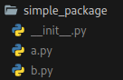

# Modularization

## Modules

> ```py
> import math
> ```

is used to provide a library

```py
math.sin(3.1415)
# 9.265358966049026e-05

sin(3.1415)
# Traceback (most recent call last):
#   File "<stdin>", line 1, in <module>
# NameError: name 'sin' is not defined
```

> ```py
> from math import sin, pi
> ```

if you import the function directly you don't need to use the "prefix" math. anymore

```py
sin(3.1415)
# 9.265358966049026e-05
```

however, only the functions that you explicitly import are available,  
i.e. sin and pi in our case.

> ```py
> from math import *
> ```

You can also import complete libraries, but this could overwrite already existing functions with the same name

```py
pi = 1337
print(pi)
# 1337

from math import *
print(pi)
# 3.141592653589793
```

### Rename

> ```py
> import math as m
> ```

you can also simply import the library and assign a new name for the namespace

```py
import math as m
m.pi
# 3.141592653589793
```

### Modul-Types

Python:

- .py
- .pyc

C-Modules:

- .pyd
- .dll
- .so
- …

c modules linked with the interpreter:

```py
import sys
print(sys.builtin_module_names)
# …
```

### Search For Modules

when importing a module, the interpreter searches in the following directories:

1. in the current directory
2. pythonpath
3. if pythonpath is not set the default directory is searched for

with sys.path you get the directories you are searching in

### Contents

with the help of the function "dir" you get all names defined in a module

```py
import math
dir(math)
# …
```

without an argument "dir" returns all names defined in the namespace

```py
import math
blibla = 123
bli = "asldfhioasp9dasdapsdas"
dir()
# …
```

### Own Modules

creating your own python module is extremely easy since every python file is automatically a module

must be present in the search path ([Search For Modules](#search-for-modules))

```py
import example_py_file
```

### Documetation

we can use docstring's to document our modules

```py
help(example_py_file)
```

[Docstring](functions.md#docstring)

## Packages

like creating a module in python, creating a package is just as easy

create a folder with the following struct:



the file `__init__.py` can be empty

the modules can now be imported with:

```py
from simple_package import a, b
```

```py
import simple_package
```

will generate an error message because the modules must be imported individually

to change this we can put:
`from simple_package import a, b`
in `__init__.py`
