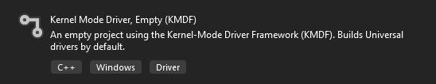
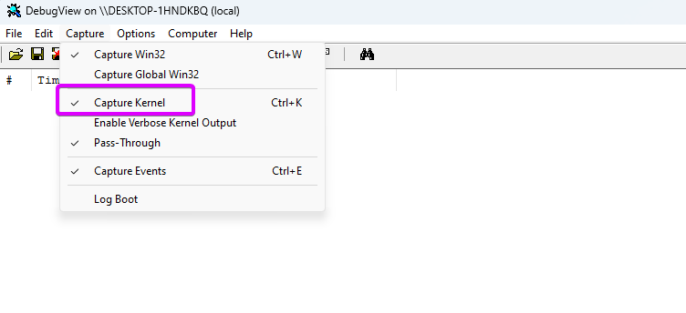
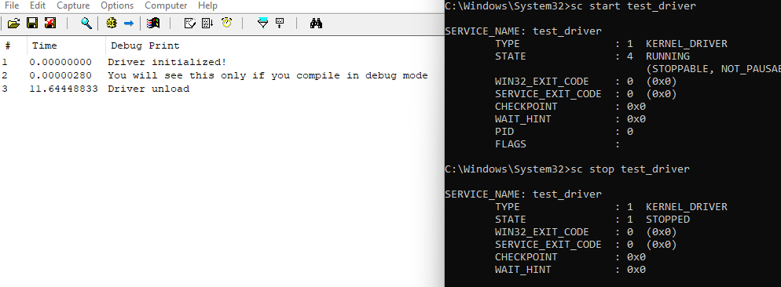
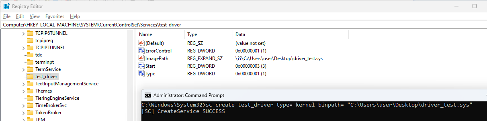

# First Kernel Mode Driver

If you have accurately followed the installation instructions outlined in the [introduction](intro.md#prerequisites),  
you should find the "Kernel Mode Driver, Empty" template in Visual Studio  
Create a new project using this preset



In the "Driver Files" section, locate the `.inf` file and delete it  
Afterward, create a new C++ source file with the name of your driver, for example, `test_driver.cpp`

---

The `ntddk.h` header file provides essential functionality and structures required for developing kernel-mode drivers.

```cpp
#include <ntddk.h>
```

[Read More](https://learn.microsoft.com/en-us/windows-hardware/drivers/ddi/ntddk/)

## Driver Entry

```cpp
extern "C" NTSTATUS
DriverEntry(_In_ PDRIVER_OBJECT DriverObject, _In_ PUNICODE_STRING RegistryPath)
{
  return STATUS_SUCCESS;
}
```

- `extern "C"` This is a C++ language feature. It specifies that the function should be treated as if it were declared in the C programming language. [Read More](https://learn.microsoft.com/en-us/cpp/cpp/extern-cpp#extern-c-and-extern-c-function-declarations)

- `NTSTATUS` is a data type representing the status of an operation in Windows kernel programming. It is an LONG value, where zero typically indicates success, and non-zero values indicate various error conditions. [Read More](https://learn.microsoft.com/en-us/windows-hardware/drivers/kernel/using-ntstatus-values)

- `DriverEntry` is a special function in Windows kernel-mode drivers. It serves as the entry point for the driver when it is loaded. The operating system calls this function after loading the driver to initialize its data structures and perform any necessary setup. [Read More](https://learn.microsoft.com/en-us/windows-hardware/drivers/wdf/driverentry-for-kmdf-drivers)

- `_In_ PDRIVER_OBJECT` is a pointer to a structure that represents a driver in the Windows kernel. The `_In_` annotation indicates that the DriverObject parameter is an input parameter, and the function will receive a pointer to the driver object. [Read More](https://learn.microsoft.com/en-us/windows-hardware/drivers/ddi/wdm/ns-wdm-_driver_object)

- `_In_ PUNICODE_STRING` is a pointer to a structure that represents a Unicode string in the Windows kernel. The `_In_` annotation indicates that the RegistryPath parameter is an input parameter, and the function will receive a pointer to a Unicode string representing the registry path relevant to the driver. [Read More](https://learn.microsoft.com/en-us/windows/win32/api/ntdef/ns-ntdef-_unicode_string)

NOTES:  
`_In_` is part of the Source Annotation Language (SAL) and is not needed compiler wise its still recommended to use them. [Read More](https://learn.microsoft.com/en-us/cpp/code-quality/understanding-sal)

## Driver Unload

To ensure proper memory management, we will define a function that automatically undoes all changes made by the driver upon unloading. This will prevent any potential leaks from persisting beyond the driver's use.

```cpp
void
TestUnload(_In_ PDRIVER_OBJECT DriverObject)
{
}
```

the pointer to the unload function must be set using the DriverUnload member of the DriverObject

```cpp
DriverObject->DriverUnload = TestUnload;
```

## Simple Debug Output

### DbgPrint

```cpp
DbgPrint("Output\n");
```

`DbgPrint` It allows you to print messages to the debugger output in both types of builds

### KdPrint

```cpp
KdPrint(("Output\n"));
```

`KdPrint` is often implemented as a macro, and it is typically included in debug builds but excluded in release builds

---

```cpp
#include <ntddk.h>

// Forward declaration of the Unload routine
extern "C" VOID
TestUnload(_In_ PDRIVER_OBJECT DriverObject);

// Entry point for the driver
extern "C" NTSTATUS
DriverEntry(_In_ PDRIVER_OBJECT DriverObject,
            _In_ PUNICODE_STRING /*RegistryPath*/)
{
  // Assign the Unload routine to the DriverUnload member of the DRIVER_OBJECT
  DriverObject->DriverUnload = TestUnload;

  // Print a message to the debugger indicating successful driver initialization
  DbgPrint("Driver initialized!\n");

  // Print a debug message using KdPrint (visible in debug builds)
  KdPrint(("You will see this only if you compile in debug mode\n"));

  // Return STATUS_SUCCESS to indicate successful driver initialization
  return STATUS_SUCCESS;
}

// Unload routine for the driver
extern "C" VOID
TestUnload(_In_ PDRIVER_OBJECT /*DriverObject*/)
{
  // Print a message to the debugger indicating driver unload
  KdPrint(("Driver unload\n"));
}
```

## Start the driver

for debugging activate testsigning on the test pc:

```cmd
bcdedit /set testsigning on
```

use:  
`sc create <drivername> type= kernel binpath= "<path to driver.sys>"`

with `sc start <drivername>` u can run ur driver and `sc stop <drivername>`will stop it

and `sc delete <drivername>` will delete it note that you cant delete a running driver

[Read More](https://learn.microsoft.com/de-de/windows-server/administration/windows-commands/sc-create)

To verify the functionality of your driver and capture debug output, you can use [DebugView](https://learn.microsoft.com/en-us/sysinternals/downloads/debugview) in administrator mode.  
By recording kernel events, you can monitor the messages generated by functions like DbgPrint or KdPrint.

To enable the capture of debug output from your driver using DebugView, you need to configure the Debug Print Filter in the Windows Registry.

Navigate to  
`HKEY_LOCAL_MACHINE\SYSTEM\CurrentControlSet\Control\Session Manager\Debug Print Filter`  
(you may need to create it).

Create a `DWORD` value named `DEFAULT` and set its value to `8`.  
After making these registry changes, it's necessary to restart the computer for the modifications to take effect.





Additionally, you can confirm the successful installation of your driver by checking the Windows Registry.  
Specifically, navigate to `HKEY_LOCAL_MACHINE\SYSTEM\CurrentControlSet\Services` and look for the entry corresponding to your driver name. A valid installation should result in the presence of the driver's registry entry at this location


