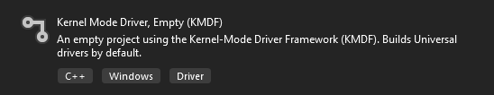
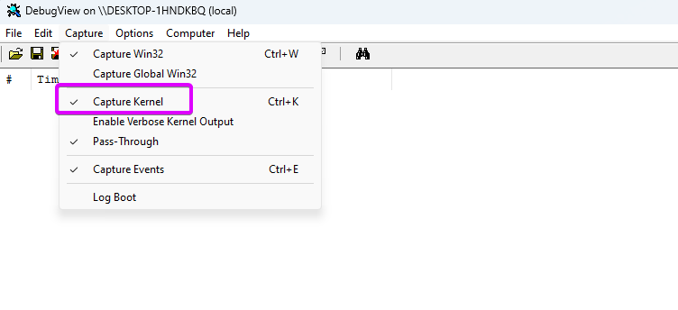
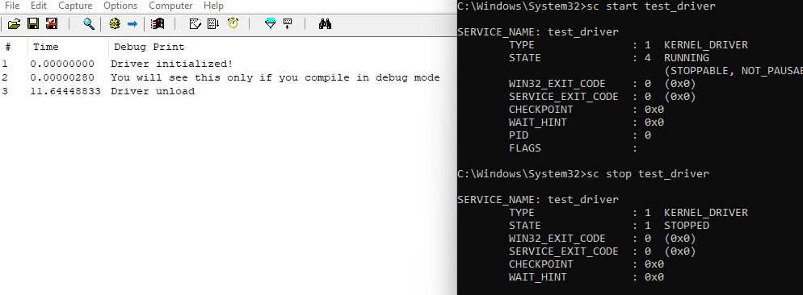
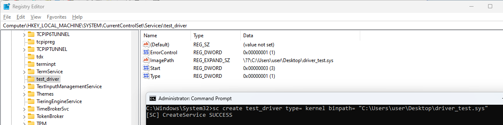

# First Kernel Mode Driver

If you have accurately followed the installation instructions outlined in the [introduction](./index.md),  
you should find the "Kernel Mode Driver, Empty" template in Visual Studio  
Create a new project using this preset



In the "Driver Files" section, locate the `.inf` file and delete it  
Afterward, create a new C++ source file with the name of your driver, for example, `test_driver.cpp`

---

The `ntddk.h` header file provides essential functionality and structures required for developing kernel-mode drivers.

```cpp
#include <ntddk.h>
```

[Learn more about the ntddk.h header file on Microsoft’s documentation](https://learn.microsoft.com/en-us/windows-hardware/drivers/ddi/ntddk/)

## Driver Entry

```cpp
extern "C" NTSTATUS
DriverEntry(_In_ PDRIVER_OBJECT DriverObject, _In_ PUNICODE_STRING RegistryPath)
{
  return STATUS_SUCCESS;
}

```


- `extern "C"` is a C++ language feature that specifies the function should be treated as if
it were declared in the C programming language.
[Learn more about `extern "C"` and function declarations](https://learn.microsoft.com/en-us/cpp/cpp/extern-cpp#extern-c-and-extern-c-function-declarations).

- `NTSTATUS` is a data type representing the status of an operation in Windows kernel programming.
It is a `LONG` value where zero typically indicates success, and non-zero values indicate various error conditions.
[See more on `NTSTATUS` values](https://learn.microsoft.com/en-us/windows-hardware/drivers/kernel/using-ntstatus-values).

- `DriverEntry` is the entry point for Windows kernel-mode drivers.
The operating system calls this function after loading the driver
to initialize its data structures and perform setup tasks.
[Read more about the `DriverEntry` function for KMDF drivers](https://learn.microsoft.com/en-us/windows-hardware/drivers/wdf/driverentry-for-kmdf-drivers).

- `PDRIVER_OBJECT` is a pointer to a structure that represents a driver in the Windows kernel.
[Explore the `DRIVER_OBJECT` structure](https://learn.microsoft.com/en-us/windows-hardware/drivers/ddi/wdm/ns-wdm-_driver_object).

- `PUNICODE_STRING` is a pointer to a structure representing a Unicode string in the Windows kernel,
often used to reference a registry path relevant to the driver.
[Learn more about the `UNICODE_STRING` structure](https://learn.microsoft.com/en-us/windows/win32/api/ntdef/ns-ntdef-_unicode_string).

:::info The Source Annotation Language (SAL)
annotations like `_In_` and `_Out_` are not strictly required for compilation
but are recommended to improve code clarity
and help static analysis tools understand the intended use of function parameters.

- `_In_` indicates that the parameter is an input to the function and shouldn’t be modified by the function.
- `_Out_` specifies that the parameter is used to return data from the function to the caller.

These annotations enhance code readability and can help catch potential bugs during development.
[Learn more about SAL and its uses](https://learn.microsoft.com/en-us/cpp/code-quality/understanding-sal).
:::

## Driver Unload

To ensure proper memory management, we will define a function that automatically undoes all changes made by the driver
upon unloading. This will prevent any potential leaks from persisting beyond the driver's use.

```cpp
void
TestUnload(_In_ PDRIVER_OBJECT DriverObject)
{
}
```

the pointer to the unload function must be set using the DriverUnload member of the DriverObject

```cpp
DriverObject->DriverUnload = TestUnload;
```

## Simple Debug Output

### DbgPrint

```cpp
DbgPrint("Output\n");
```

`DbgPrint` It allows you to print messages to the debugger output in both types of builds

### KdPrint

```cpp
KdPrint(("Output\n"));
```

`KdPrint` is often implemented as a macro, and it is typically included in debug builds but excluded in release builds

## Download Project

You can download the driver example project from here:


import {Sample} from "../../../src/components/homepage/GuidesAndSamples";

<div className="w-full md:max-w-sm">
    <div className="flex flex-col gap-4">
        <Sample title="simpleWinDriver" platform="" demo="https://github.com/Arteiii/simpleWinDriver"
                buttonlabel="Template"
                source="https://github.com/new?template_name=simpleWinDriver&template_owner=Arteiii"></Sample>
    </div>
</div>


## Starting the Driver

To enable driver testing on your test machine, you’ll need to activate test-signing mode.
This allows the installation and running of unsigned drivers:

```cmd
bcdedit /set testsigning on
```

Next, create the driver service using the `sc` (Service Control) command:

```cmd
sc create <drivername> type= kernel binpath= "<path to driver.sys>"
```

To start the driver, use the following command:

```cmd
sc start <drivername>
```

You can stop the driver with:

```cmd
sc stop <drivername>
```

If you need to remove the driver, use:

```cmd
sc delete <drivername>
```

**Note:** Ensure that the driver is stopped before attempting to delete it, as active drivers cannot be removed.


[Detailed guide on using `sc create` for service creation](https://learn.microsoft.com/de-de/windows-server/administration/windows-commands/sc-create)

To verify the functionality of your driver and capture debug output, you can
use [DebugView](https://learn.microsoft.com/en-us/sysinternals/downloads/debugview) in administrator mode.  
By recording kernel events, you can monitor the messages generated by functions like DbgPrint or KdPrint.

:::info
To enable the capture of debug output from your driver using DebugView, you need to configure the Debug Print Filter in
the Windows Registry.

Navigate to  
`HKEY_LOCAL_MACHINE\SYSTEM\CurrentControlSet\Control\Session Manager\Debug Print Filter`  
(you may need to create it).

Create a `DWORD` value named `DEFAULT` and set its value to `8`.  
After making these registry changes, it's necessary to restart the computer for the modifications to take effect.
:::





Additionally, you can confirm the successful installation of your driver by checking the Windows Registry.  
Specifically, navigate to `HKEY_LOCAL_MACHINE\SYSTEM\CurrentControlSet\Services` and look for the entry corresponding to
your driver name. A valid installation should result in the presence of the driver's registry entry at this location


