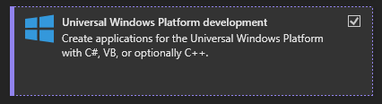
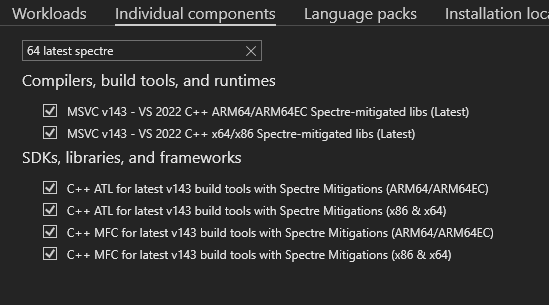

# Intro

# Prerequisites

Developing a Windows kernel driver is essential for tasks like hardware interaction, performance optimization,  
security software creation, virtualization support, implementing custom system services, and achieving real-time processing.  

Kernel drivers operate with higher privileges, directly interacting with the kernel for tasks like hardware management,  
offering superior performance. However, they require meticulous security considerations to prevent system instability,  
unlike user-mode applications, which are more isolated and less prone to impacting system integrity.

## Step 1: Install Visual Studio 2022

:::note
Note that other versions of Visual Studio may also work, but the steps might differ.
:::
Download Visual Studio 2022 [here](https://visualstudio.microsoft.com/de/)

During installation, select "Desktop development with C++."

Install all relevant components related to Spectre mitigations to avoid compilation errors.  
Go to the "Individual Components" tab and search for "64 latest Spectre"

You can find more information about Spectre mitigations [here](https://devblogs.microsoft.com/cppblog/spectre-mitigations-in-msvc/).

:::note
The instructions provided are based on the usage of Visual Studio 2022 Preview, but similar steps should apply to the default version.
:::

## Step 2: Install Windows SDK and WDK

Install the Windows SDK from [this link](https://developer.microsoft.com/ja-jp/windows/downloads/windows-sdk/).

After installing the Windows SDK, download and install the Windows Driver Kit (WDK) from [here](https://download.microsoft.com/download/7/b/f/7bfc8dbe-00cb-47de-b856-70e696ef4f46/wdk/wdksetup.exe).  

If you encounter any issues with the links, please open an issue on [GitHub](https://github.com/Arteiii/arteiii.github.io/issues/new) so that I can fix it. You can also refer to the official documentation [here](https://learn.microsoft.com/ja-jp/windows-hardware/drivers/download-the-wdk).

## Step 3: Additional Tools

It is recommended to download the SysInternalsSuite, which includes a set of powerful utilities for Windows system troubleshooting, monitoring, and debugging. These tools, developed by Mark Russinovich and Bryce Cogswell, provide insights into the operating system's behavior and can be useful for driver development.

You can download the SysInternalsSuite [here](https://learn.microsoft.com/ja-jp/sysinternals/downloads/sysinternals-suite).

Notable tools in the SysInternalsSuite include:

[Process Explorer](https://learn.microsoft.com/en-us/sysinternals/downloads/process-explorer): Provides detailed information about running processes, including their dependencies.
[ProcMon](https://learn.microsoft.com/en-us/sysinternals/downloads/procmon): Monitors and logs system activity, helping to identify issues with file and registry operations.
[DbgView](https://learn.microsoft.com/en-us/sysinternals/downloads/debugview): Captures debug output from various sources, aiding in debugging and troubleshooting.

## Step 4: Virtual Machine Setup

For testing and debugging drivers, you can use VMware. However, feel free to use your preferred virtualization software. Refer to your VM's documentation for specific setup steps, as they may vary.

:::note
If you opt to use an official VM image from Microsoft, available [**here**](https://developer.microsoft.com/en-us/windows/downloads/virtual-machines/), be aware that it comes with some pre-installed tools for developers. While convenient, these tools may not align with your specific requirements. Additionally, please note that the VM images may run on evaluation time and could expire after some time.

---

If you need to download specific Windows versions (ISOs), you can visit the Page [**here**](https://files.rg-adguard.net/version/f0bd8307-d897-ef77-dbd6-216fefbe94c5). it's important to note that these sources might not be secure. Use such sources within a virtual machine environment, without sensitive data, and be aware that I don't cover the security or authenticity of alternative download locations. Always prioritize [**official channels**](https://www.microsoft.com/ja-jp/software-download/windows10) for downloading operating system ISOs when possible.
:::

If you encounter any broken links or have suggestions, kindly open an issue on [GitHub](https://github.com/Arteiii/arteiii.github.io/issues/new). Your feedback is appreciated!

## References

[MSDN](https://learn.microsoft.com/en-us/windows-hardware/drivers/download-the-wdk)  
[Spectre mitigations in MSVC](https://devblogs.microsoft.com/cppblog/spectre-mitigations-in-msvc/)  
[MSDN /Qspectre](https://learn.microsoft.com/en-us/cpp/build/reference/qspectre)  
[Download the Windows Driver Kit (WDK)](https://learn.microsoft.com/en-us/windows-hardware/drivers/download-the-wdk)  
[Official Iso Download](https://www.microsoft.com/ja-jp/software-download/windows10)
[rg-adguard (Old ISO versions)](https://files.rg-adguard.net/version/f0bd8307-d897-ef77-dbd6-216fefbe94c5)
[sysinternals](https://learn.microsoft.com/ja-jp/sysinternals)
