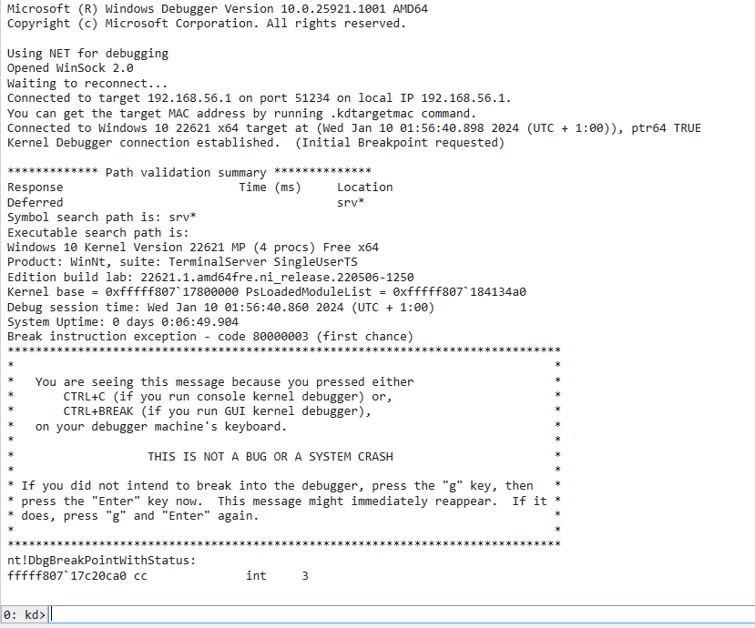
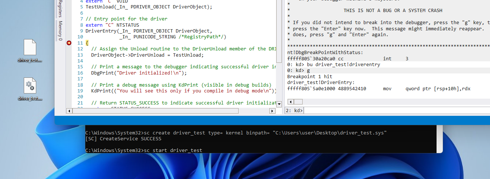

# Kernel Debugging


## Full Kernel Debuggers

Establishing communication for comprehensive kernel debugging within a virtual machine offers various options. This article will guide you through the process of setting up communication with a COM device exposed to the host system as a named pipe

Ensure that secure boot is disabled in the virtual machine!

In an Elevated Command Prompt, execute the following commands:

```cmd
bcdedit /debug on
```

[Read More](https://learn.microsoft.com/en-us/windows-hardware/drivers/devtest/bcdedit--debug)

### VM setup (COM)

import adddevice from "/img/windows/kernel/kernel_debugging/vmware_YU0yTtaigA.png"
import configurevmwaredevice from "/img/windows/kernel/kernel_debugging/vmware_agquvVy0bW.png"

```cmd
bcdedit /dbgsettings serial debugport:1 baudrate:115200
```

Let's break down the components:

- /dbgsettings: This flag indicates that debugging settings are being configured

- serial: Specifies the type of debugging connection, in this case, a serial connection

- debugport:1: Sets the debug port to 1. The debug port is a crucial parameter as it designates the communication channel through which debugging information is transmitted

- baudrate:115200: Establishes the baud rate for the serial connection at 115200. Baud rate is the speed at which data is transmitted, and in debugging scenarios, it is set to ensure efficient and reliable communication between the virtual machine and the debugging tools

  [Read More](https://learn.microsoft.com/en-us/windows-hardware/drivers/devtest/bcdedit--dbgsettings)

---

After completing the debugging configuration, shut down the virtual machine

In VMware, you can add a virtual COM device to the VM. To do this, navigate to the VM settings. Look for the option to add hardware, and choose "Serial Port" from the list


---

Once you've added the virtual serial port, configure it to use a named pipe  
This establishes a communication channel with the host system  
In the settings, specify the pipe name for the COM device (`\\.\pipe\debugvm`)

For further assistance on configuring named pipes in VMware, refer to the [VMware documentation](https://docs.vmware.com/en/VMware-Workstation-Pro/17/com.vmware.ws.using.doc/GUID-70C25BED-6791-4AF2-B530-8030E39ED749.html)


Start the virtual machine and ensure that the virtual COM device is correctly connected

### WinDBG (COM)
import WinDbgFile from "/img/windows/kernel/kernel_debugging/DbgX.Shell_hnysQdHmnu.png"
import AttachToKernel from "/img/windows/kernel/kernel_debugging/DbgX.Shell_KGZopkn2gw.png"
import ComAttachMenu from "/img/windows/kernel/kernel_debugging/DbgX.Shell_9hq8b5YEXp.png"


[Download](https://learn.microsoft.com/en-us/windows-hardware/drivers/debugger/)

1. Launch WinDbg and navigate to the "File" menu located in the top left corner  

   

2. Select "Attach to Kernel" from the menu options

   

3. In the COM settings, enter the port you defined in VMware (`\\.\pipe\debugvm`).  
Additionally, set the baud rate to `115200`. Click "OK" to confirm the configuration

   


### VM setup (Net)

```cmd
bcdedit /dbgsettings net hostip:<ip> port:<port>
```

- `/dbgsettings net`: This flag indicates that network debugging settings are being configured.

- `hostip:<ip>`: Specifies the IP address of the host machine that will be used for network debugging. Ensure that this IP address aligns with the host machine's network configuration.

- `port:<port>`: Sets the port number for the network debugger connection. The chosen port, in this case, is `51234` (Should be 49152 or higher)

example:

```cmd
bcdedit /dbgsettings net hostip:192.168.56.1 port:51234
```


### WinDBG (Net)
import NetConfig from "/img/windows/kernel/kernel_debugging/DbgX.Shell_Hg7BXHCNZq.png"


In the NET settings, enter the port you defined (`51234`). Additionally, set the baud rate to `115200`. Click "OK" to confirm the configuration


The encryption key is generated automatically when you run the bcdedit command.  
Alternatively, you have the option to manually define the key using the `key:<key>` parameter

```cmd
bcdedit /dbgsettings net hostip:192.168.56.1 port:51234 key:1.3.3.6
```

[Read More](https://learn.microsoft.com/en-us/windows-hardware/drivers/devtest/bcdedit--dbgsettings)

---



Additionally, note that the virtual machine will remain in a "frozen" state until you remove the breakpoint and resume execution using either **F5** or `g` in the command line

## Basic usage of WinDbg

:::info
For a quick reference guide to WinDbg commands and usage,  
check out the [WinDbg Cheat Sheet by repnz](https://github.com/repnz/windbg-cheat-sheet). 
:::


### Breakpoints

- Set Breakpoint: `bp` followed by the address or symbol
- Clear Breakpoint: `bc` followed by the breakpoint number

### Execution Control

- Run (Continue Execution): `g` or **F5**
- Step Into: `p` or **F11**
- Step Over: `t` or **F10**
- Step Out: `gu`

### Stack

- View Stack: `k` or `kb`
- Set Stack Frame: `frame <frame number>`

### Modules and Symbols

- List Loaded Modules: `lm`
- Reload Symbols: `.reload`

### Control Flow

- Set Next Statement (Jump): `j <address>`

### Thread Control

- Switch Thread: `~<thread number>s`
- View All Threads: `~`

### Symbols

`SRV*c:\Symbols*http://msdl.microsoft.com/downloads/symbols`
set the symbols path to this value either by using the registry key or the options in windbg (File > Settings > Debugging Settings > Sybmols Path)


## Debugging ur Kernel Driver

To set a breakpoint at the driver entry, use the `bu` (unresolved breakpoint) command  
This is particularly useful when setting a breakpoint on code that has not yet been loaded,  
such as our `driverentry` function

In this example, use`bu driver_test!driverentry`  
Replace 'driver_test' with your driver name

Load the driver by using `sc start <drivername>`


