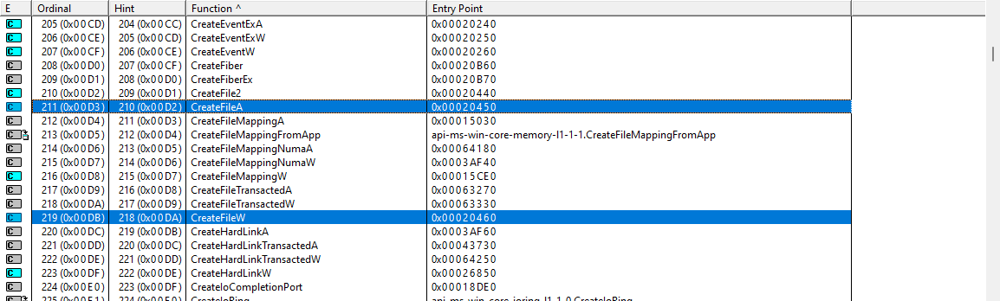

# Conventions

## Unicode

Most Windows internal text strings are stored and processed as 16-bit wide UNICODE (UTF-16LE).

For compatibility reasons, many Windows functions with string parameters have 2 entry points.
One for **Unicode (wide, 16-bit)** and another for **ANSI (narrow, 8-bit)**.

Since Windows uses Unicode internally, you may experience performance issues.
if you use ANSI (narrow version), because Windows would have to convert it to Unicode first, then process it, and then convert the output back to ANSI.

For example, the Windows API function _CreateFile_ is just a macro that expands to :

- CreateFile**A** (**A**NSI)
- CreateFile**W** (Unicode, **W** stands for wide)

view of [dependency walker](https://dependencywalker.com/) with the kernel32.dll opened

as you see most functions that have at least one string type argument are pairs (CreateFileMapping A/W, CreateHardLink A/W)

Don't forget to leave out the end (A/W) when you look it up in the microsoft documentation.

## Ex

When Windows updates functions that are incompatible with their predecessors, it creates a new version with the same name but with an "Ex" suffix. The "Ex" denotes version 2, so if the function is updated again, it will have two "Ex's"
