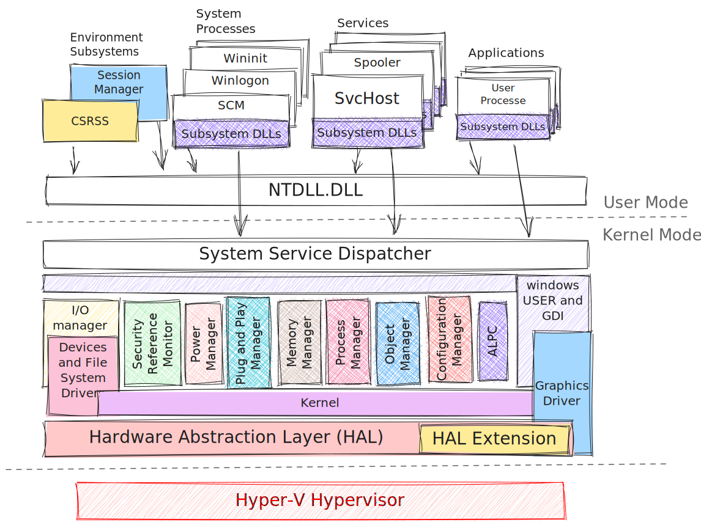

# Windows Architecture

## Executives

### Configuration Manager

The Configuration Manager is responsible for implementing and managing the system registry.

### Process Manager

The Process Manager creates and terminates processes and threads, with underlying support provided by the Windows kernel. The Executive adds additional semantics and functions to these underlying lower-level objects.

### Security Reference Monitor (SRM)

is responsible for enforcing security policies on the local machine. It safeguards operating system resources, performing real-time object protection and auditing.

### I/O manager

Implements device-independent I/O and is responsible for dispatching to the appropriate device drivers for further processing.

### Plug and Play (PnP) manager

soon...
